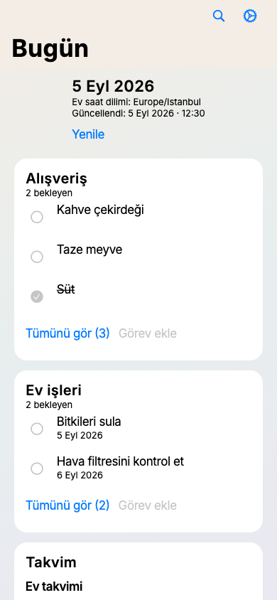
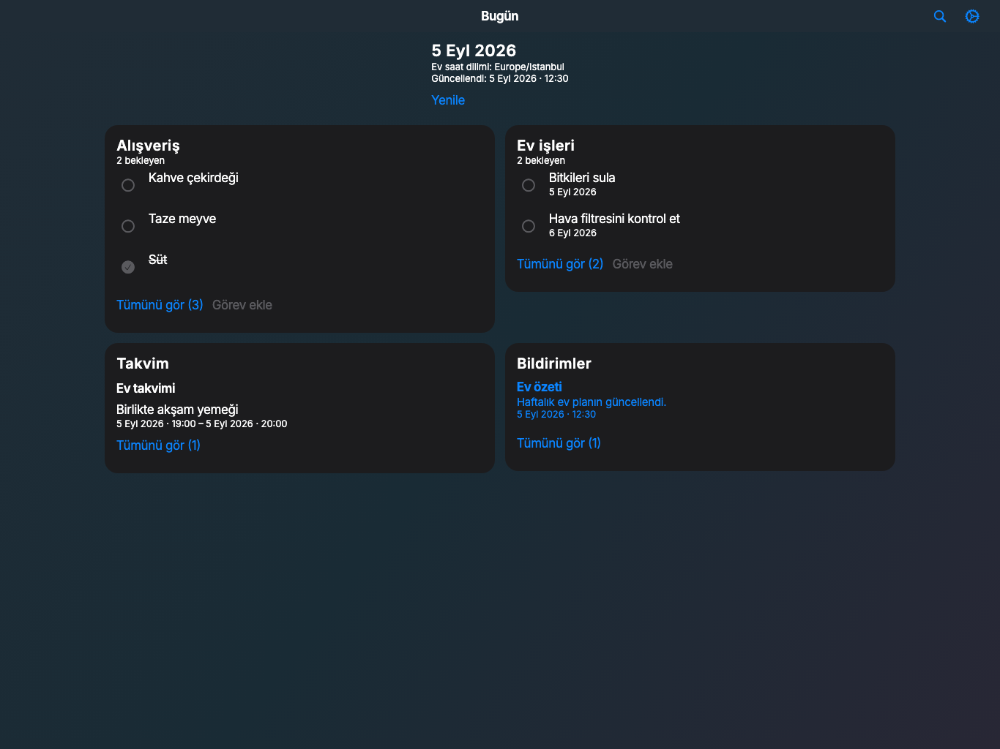
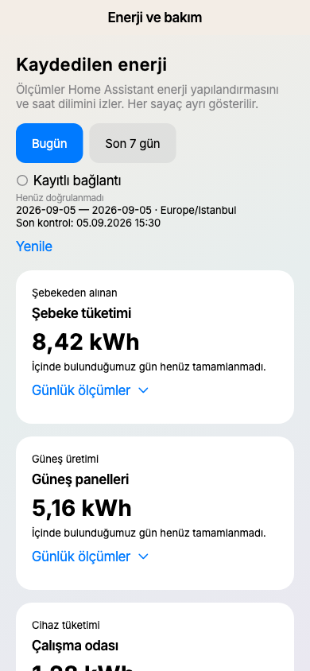
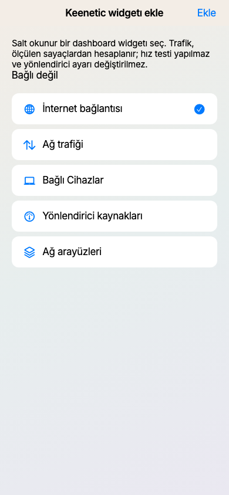
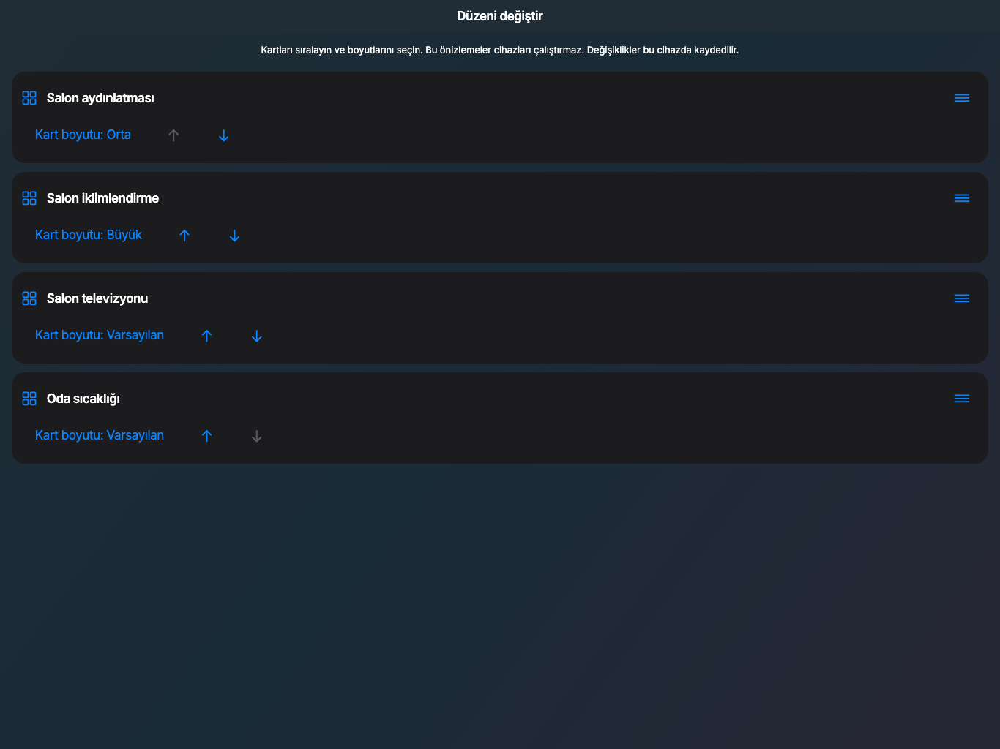
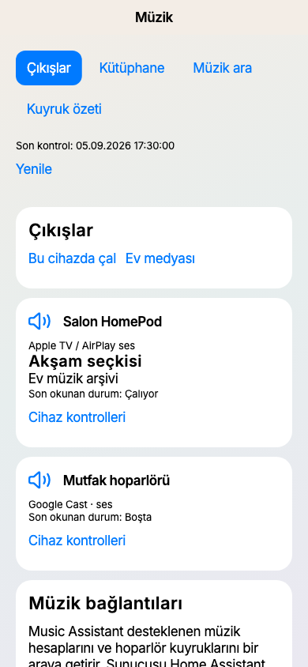
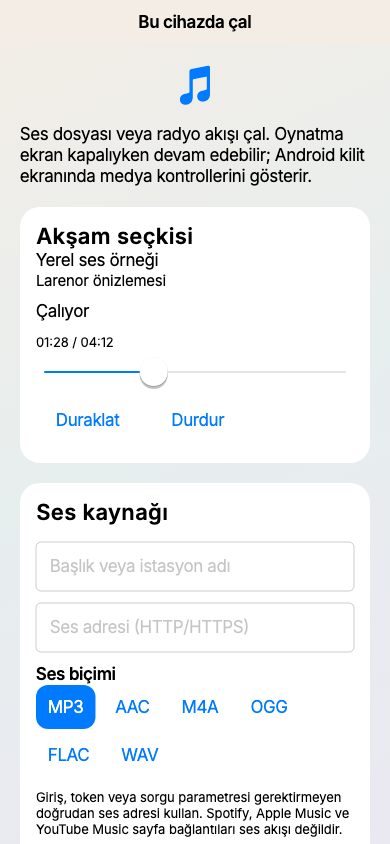
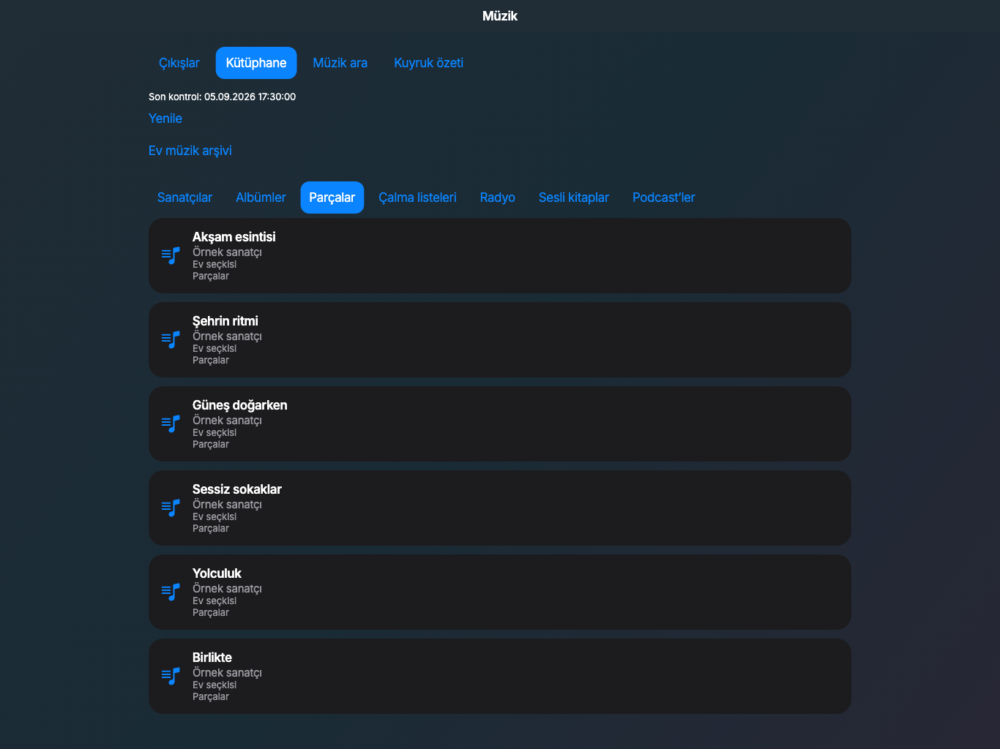
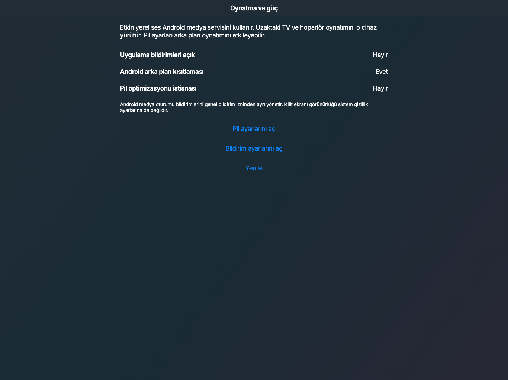

# Larenor


*Unus Lar, omnem domum servat.*

A private, custom Home Assistant companion app built with Flutter. Larenor connects to
an existing self-hosted Home Assistant server over its REST and WebSocket APIs and
turns an Android tablet into an Apple Home-inspired wall panel — plus an in-app admin
panel, a unified Netflix-style media hub over a self-hosted Jellyfin/*arr/qBittorrent
stack, and infrastructure management for Proxmox VE and Keenetic routers.

This is not a fork of Home Assistant. It is a standalone client; you still need a
running Home Assistant instance on your network.

This repository and its contents are proprietary — see [LICENSE](LICENSE).

## Features

### Localization

- English and Turkish, following the device's system language automatically — no
  in-app language switch needed, and no language ever gets stuck after an update or
  reinstall since it just re-reads the OS setting. Falls back to English on any other
  device language.

### Shared navigation and connection evidence

- Home, Media, Routines and System share stable routes, with a sidebar on wide
  windows and tabs on smaller screens. Room selection and scroll position survive
  switching tabs; everyday service screens are reachable outside Settings.
- Local search finds rooms, accessories, scenes, cached media and configured
  services, plus Today, Intercom and Energy & maintenance. Turkish spelling is normalized. Opening or
  typing in search does not initialize service connections or scan remote libraries.
- Connection labels distinguish saved configuration, server contact and a valid
  data read. Partial media errors remain visible. An unchanged device state is not
  treated as an offline connection.
- HA controls show sending, server acknowledgement, observed state, failure or an
  uncertain outcome. Observing a reported state is not proof of physical causality.
  Duplicate submissions are guarded; uncertain mutations are never auto-retried.

### Today

- A daily overview combines HA to-do lists, calendar events and persistent
  notifications, using the Home Assistant time zone, including daylight-saving
  transitions and all-day events.
- Open a list to add or edit supported fields, complete an item or undo completion.
  Updates use item IDs and explicit readback; unavailable lists and stale reads are
  shown separately from empty lists. Foreground refreshes are bounded and stop in
  the background.
- Notification reading is local to the current account/session. Removing a
  notification from Home Assistant requires a separate confirmation. Calendars are
  currently read-only; this screen does not create phone push notifications.

### Intercom foundation — Netelsan Algan 7

- Settings → Intercom maps an existing HA camera, chime, active-call sensor, door
  contact and commissioned `button`/`lock` release control. Home and local search
  open the daily intercom page. Mapping changes are local to Larenor.
- Camera snapshots show their receive time and keep a visibly stale last image
  when refresh fails; hidden pages stop polling. Snapshot receipt is not a live
  video or capture-time guarantee.
- Door release starts disabled and requires an explicit, named confirmation,
  current live HA connection evidence and, by default, an active call. The approval
  expires after 30 seconds and is invalidated by account, mapping, call or lifecycle
  changes. Importing the mapping from a backup disables release until recommissioned.
- The Algan 7 needs a revision-specific, isolated hardware bridge. Its door button
  releases during a call and changes the camera view when idle. There is no direct
  Algan IP integration, universal wiring pinout, audio bridge or installed firmware
  in this delivery. See the [hardware foundation](docs/intercom-hardware-foundation-2026-09-05.md).

### Home Assistant connection

- Connect with a server URL and a long-lived access token from your HA profile.
  The REST client preserves reverse-proxy prefixes, validates API paths, rejects
  cross-server redirects and reports structured authentication/permission errors.
- Automatic discovery of Home Assistant servers on the local network via mDNS/
  Zeroconf (HA's `zeroconf` integration), listed on the connect screen so you can
  tap one instead of typing the URL by hand.

### Dashboard

- Apple Home-inspired Cupertino interface with adaptive light/dark backgrounds,
  rounded accessory cards and clear active, inactive and unavailable states. Wide
  tablets get a room sidebar; smaller screens get a horizontal room selector.
- An overview shows the number of displayed accessories, lights switched on and
  unavailable devices. Room selection and category chips (Lights / Climate /
  Security / Media) help narrow the view.
- Rooms are yours to create, rename, reorder and remove. Add multiple accessories
  to a room from the device picker; removing one from a room does not delete it
  from Home Assistant. Saved room layouts and favourites survive app restarts.
- **Link a Home Assistant area** stores its server and area identity locally.
  Read and preview additions/removals before applying them to Larenor. Manual
  members and explicit exclusions survive synchronization; a missing area or
  failed registry read never deletes the local room. Changing servers hides
  mismatched bound-room devices until you relink. No area is edited in HA.
- **Edit cards** adjusts sizes and order for accessories, services and custom
  widgets. The responsive grid preserves reading order and builds visible cards
  lazily; layout and binding metadata are included in the encrypted backup.
- The picker focuses on controllable domains and useful sensor device classes
  (temperature, humidity, motion, door…) rather than diagnostic entities. The
  dashboard displays the accessories you selected, not every entity automatically.
- Tap a supported accessory to toggle it; locks and covers open their detail sheet.
  Long-press for details, favourite/unfavourite, or removal from its room.
  Favourites appear at the top. Service-call failures are shown to the user.
- A "Services" section carries external-service summaries. **Add widget** offers
  entity, camera, climate, media player, scene, weather, numeric history, website
  and Keenetic metric cards. Choosing a type filters compatible current-account
  entities; previews never operate a device. Card selection and saving reject
  stale accounts, background drafts and duplicate submissions.
- History cards use real HA Recorder history for the previous 24 hours; unknown
  samples break the graph instead of becoming zero. Website cards validate both
  saved URLs and navigation, retire pages while hidden and show safe load errors.
  They never inject an HA token, grant camera/microphone access or bypass TLS.
- Tap-through "more info" popup on every accessory — full state, attributes, and
  controls, not just the inline toggle.
- Connection-status banner ("Home Assistant unreachable, retrying…") instead of a
  small status dot, with retry/pull-to-refresh controls and WebSocket reconnect
  with backoff. A fresh snapshot is fetched after reconnecting; updates arriving
  during a snapshot request are preserved, including entity removals. Heartbeats
  detect dead sockets; live tool subscriptions acknowledge setup and stop cleanly
  on disconnect. Timed-out device mutations are never automatically retried.
- Broad brand/device coverage: icons and controls for lights, switches, locks (state-
  aware), vacuums, humidifiers, valves, sirens, alarm panels, covers, fans, climate,
  media players, cameras, device trackers (e.g. Keenetic presence), water heaters,
  scenes, persons, timers, scripts, updates, numbers, selects, and buttons, plus
  device-class-aware sensor/binary_sensor icons (battery, power/energy, temperature,
  motion, connectivity, etc. — covers what integrations like Anker Solix, Xiaomi,
  Sonoff, Philips Hue, Apple HomeKit, and eWeLink commonly expose). Home Assistant's
  domain/device_class model is brand-agnostic, so rendering every domain and device
  class allows the same controls to serve many HA-supported brands, including
  entities exposed by HACS integrations. Actual support depends on each entity
  domain and the capabilities exposed by the server.

### Energy & maintenance

- Home and local search open recorded energy for today or the last seven days,
  using HA's configured meters and time zone. Grid import/export, solar, battery,
  device consumption and recorded costs remain separate; parent and child meters
  are not added together as an invented house total.
- Recorder statistics are read in bounded batches with validated units. Missing
  hours, missing baselines, unfinished days and time-zone boundary limitations
  are labeled. Missing data stays unknown. Costs use recorded currency statistics,
  without applying the current tariff to historical usage.
- Device maintenance lists low batteries, unavailable devices, problem sensors
  and pending updates, scoped to dashboard selections or all current entities.
  Open the normal device detail to investigate. The page does not install updates
  or act on devices automatically.
- Configured Proxmox nodes show CPU, memory and root filesystem capacity alongside
  maintenance. Offline/unknown nodes do not display stale values as current usage;
  shared storage is not added to node disk totals.

### Home Assistant actions, tools and administration

Settings → Home Assistant uses the same adaptive Cupertino layout as Home and Media.

- **Actions** discovers every action advertised by the connected server, including
  installed custom integrations. Search by domain, name or description; select
  entity targets or enter device/area/floor/label targets; edit typed fields; request
  and inspect service response data when supported. Required fields and numeric
  limits are validated. Advanced JSON supports additional and complex parameters.
  An accessory's details links directly to actions for that domain.
- **Device controls** in the accessory sheet include climate mode/temperature and
  dual setpoints, cover position/open/close/stop, lock/unlock with unlock confirmation, fan speed,
  number/select helpers and media transport/volume. Live action availability and
  entity features constrain what appears. Sliders submit on release; errors and
  duplicate-request guards apply to these controls.
- **Developer tools** provides server information, history/activity queries,
  calendars, templates, logs and configuration checks. Events can be listed or
  watched live; the viewer retains the latest 50 messages. The REST/WebSocket
  console supports additional server commands and explicit subscription mode.
- **Integrations** supports discovery/setup, options, reconfiguration, pending
  discovery/reauthentication flows, rename, enable/disable, reload and removal.
  Native fields cover text, numeric, boolean, select and entity/device/area pickers;
  other selectors use validated JSON. External authentication steps open their
  provided page and resume the server flow.
- **Devices / Areas / Entities** offers native registry editors: area creation,
  rename/removal; device name/area/enabled state; entity name/icon/area/ID and
  enabled/hidden state. Entity ID changes also migrate local room, favourite,
  hidden-entity and tile references.
- **Automations** supports listing, enabling/disabling, running, duplication and
  JSON configuration create/edit/delete. The full visual editor and traces remain
  available in Home Assistant's own frontend.
- **Cameras** provides periodic snapshot browsing and image expansion, with receive
  times and visible stale-image errors.
- **Home Assistant workspace** opens the official frontend inside the app for
  server-specific panels such as Energy, maps, backups, Assist and custom
  dashboards. It uses its own sign-in session; the app never injects its long-lived
  API token into web scripts or browser storage. Browser/platform-dependent
  functions such as microphone capture and downloads need separate device testing.

The [API coverage matrix](docs/home-assistant-api-coverage.md) distinguishes native
screens, Dart API methods, generic tools and the embedded frontend. A transport
method or a displayed action is **not** proof that every HA feature has a native
UI or that every device action was executed. State writes only change HA's state
representation; physical devices are controlled through actions.

### Kiosk / wall-panel mode

- Android `HOME` intent-filter so the app can be set as the tablet's default launcher.
- Always runs fullscreen (status/navigation bars hidden), reapplied automatically on
  every resume so it stays hidden after backgrounding, permission dialogs, etc.
- Keep-screen-on toggle (wakelock).
- Scheduled day/night screen brightness dimming and screen-off/do-not-disturb hours.
- Idle/ambient mode — after N minutes of no touch input, switch to a low-distraction
  clock + weather screen (reduces burn-in on an always-on panel).
- PIN lock on Settings, so leaving kiosk mode or changing the server connection
  requires a PIN.

### Media hub

One Netflix-style surface across every connected media service, instead of a screen
per service. Reachable from the dashboard's media shortcut or Settings → Integrations.
The hub follows the same light/dark appearance, page palette, navigation and
typography as Home and Settings, with a cinematic artwork area, poster rows and
All / Movies / TV filters. Netflix account login, Netflix's catalogue and direct
Netflix playback are not implemented; playback uses your connected Jellyfin server.

- **Browse** — a featured hero plus poster rows: Continue Watching and Recently Added
  from Jellyfin, Trending from Jellyseerr, Coming Soon from the merged Sonarr/Radarr
  calendars, and everything currently Downloading. A row hides itself when the service
  behind it isn't connected, so the hub works with any subset — Jellyfin alone,
  Jellyseerr alone, or all of them.
- **Search** — one box across your library and the requestable catalogue. Without
  Jellyseerr, connected Sonarr/Radarr lookup endpoints provide discovery and the
  add-to-library flow. Matching titles are deduplicated by known provider IDs;
  the result shows its availability.
- **One page per title** — the point of the whole thing. Its primary button resolves
  from actual state: **Play** if it's in Jellyfin, **Request** through Jellyseerr if it
  isn't, **Add to library** via Sonarr/Radarr if you don't run Jellyseerr, or live
  download progress if a grab is already underway. Below it: monitored state and
  Bazarr's missing-subtitle count for that exact title.
- **How the join works** — TMDB id is the key. Jellyseerr is TMDB-native, Radarr keys
  on `tmdbId`, Sonarr carries one alongside `tvdbId`, and Jellyfin exposes all three
  through `ProviderIds`. A single index is built once per refresh from the Jellyfin,
  Sonarr and Radarr libraries and stores each title under *every* id it knows, so a
  TVDB-only Sonarr entry still meets a TMDB-only Jellyseerr result. Films and TV
  sharing a numeric id never collide, since kind is part of the key. Episode IDs
  are kept separate from series IDs so continue-watching items resolve to the
  correct show. Jellyfin library indexing follows pagination beyond 2,000 items.
- **TV playback** — series open a season/episode browser with watched and resume
  progress; actual episodes are passed to the player. A continue-watching episode
  resumes that episode rather than attempting to play a series container.
- Posters are disk-cached and content-addressed by Jellyfin's own image tags, so
  artwork survives a cold start and is only re-fetched when it genuinely changes.

Lidarr and Readarr stay on their own screens — music and books need a different
identity scheme (MusicBrainz/Goodreads, not TMDB) and suit a poster-row layout poorly.

### Media progress and movie night

- Each title separates request approval, transfer/queue progress, import state,
  files reported by Arr/Seerr and playback candidates verified by the current
  Jellyfin account. Unknown progress stays unknown; a series may contain available
  episodes while another season is downloading.
- Season coverage retains its source and unknown counts. Missing, virtual,
  inaccessible and unverified Jellyfin items cannot start playback. The episode
  browser shows the coverage this server/account reports; it does not claim to
  enumerate every episode that exists in external catalogues.
- Direct film/TV links resolve through authenticated item or catalogue detail
  reads, including titles outside discover feeds. Account changes invalidate old
  item actions, drafts and asynchronous completions.
- **Movie night** previews a chosen HA scene/script, sends it once, then opens the
  playable item's player after server acceptance. Returning from the player offers
  a separately selected finishing scene with its own confirmation. Scene acceptance
  is not device completion; failed or uncertain actions are not auto-retried, and
  no scene is automatically reversed. Choices are included in encrypted backups.

### Play on a TV

- A playable film or episode can be sent to an active, remotely controllable
  Jellyfin TV session signed in as the same user. Opening the target picker starts
  discovery; merely displaying the button does not. The item and receiver are
  checked again before a named confirmation and a single play request.
- Server acceptance, the receiver reporting the selected item, and an uncertain
  outcome are distinct. An unchanged old playback state cannot confirm a new
  request. Account changes and backgrounding invalidate pending confirmations;
  uncertain playback requests are not automatically repeated.
- This path sends the library item ID, never the tablet's streaming URL or token.
  The receiving Jellyfin app negotiates its own codecs.
- **Home media** browses the connected Home Assistant media-source tree and
  offers registered, available receivers with the advertised playback capability.
  Choose a source, choose an output, then confirm the named request. Source and
  receiver identities are checked again before sending one command; account,
  connection and visibility changes invalidate pending requests.
- Audio can use compatible Cast or Apple/AirPlay outputs through HA. Video requires
  an explicitly identified display receiver. The HA 2026.8.3 Apple TV media-source
  path is audio-only here; direct Apple TV video and physical receiver acceptance
  remain pending. See the [API and device review](docs/casting-implementation-review-2026-09-05.md).

### Music and background audio

- **Music** joins output devices, their latest playback metadata, library, search
  and queue summary. Catalog reads use explicit server selection, bounded pages
  and submitted searches. Queue reads run while visible and refresh on request;
  unavailable data is distinguished from an empty library.
- An installed **Music Assistant** integration in Home Assistant enables the
  supported library/search/queue services. Select a catalog item and output,
  then confirm playback. The app rechecks the catalog and receiver before one
  request, and distinguishes server acceptance from observed playback. The queue
  view shows the current and next items returned by HA, not a fabricated full queue.
- Spotify, Apple Music and YouTube Music require supported provider setup on a
  Music Assistant server. Subscriptions alone do not configure that server.
  Larenor includes a native music interface, not the Music Assistant server engine;
  running that complete engine inside Android and direct subscription SDK login
  are not implemented. No server is installed or account connected automatically.
- **Play on this device** uses an Android Media3 player and MediaSessionService for
  anonymous HTTP(S) audio files or radio streams. MP3/AAC/M4A/OGG/FLAC/WAV source
  types are supported subject to the actual stream and device codecs. User-started
  playback can continue with the screen off and exposes title, artist, album,
  progress and transport controls to Android's lock screen. Artwork is not yet
  supplied. Authenticated URLs, query tokens and subscription web links are not
  accepted as direct audio sources.
- A single local audio session handles audio focus and headphone disconnection;
  opening Jellyfin video first stops local audio. Closing the audio screen does
  not stop an ongoing track. Process restart does not silently restart playback.
- **Playback & power** reads the device's notification/background/battery state
  and opens the relevant system settings on request. It does not silently grant
  permissions or exempt the app from OEM power management. The local player does
  not require GMS. Actual Huawei/DeX background and lock-screen acceptance remains
  a device test; remote speaker playback is performed by that speaker/server.

### Media stack

Nine independent, optional integrations for a self-hosted media server setup — the app
works fine with zero, some, or all of them configured (see "Integrations management"
below for how they're toggled and surfaced). Each service's connect screen shows a
"Found on your network" list before you type anything: Jellyfin uses its own UDP
broadcast discovery protocol, and the rest are found by sweeping the local subnet for
a matching signature on their default port (no credentials needed for this — it's
purely a convenience to save typing an IP, tap a result to fill in the URL). Every
service also gets its real logo mark next to its name throughout the app instead of a
generic icon:

- **Jellyfin** — connect with a username/password, browse continue-watching/recently-
  added/libraries, and play through a built-in `media_kit` (libmpv) video player with
  fully custom Cupertino controls (no stock Material overlay). The player negotiates a
  device profile with the server so playback decodes on the tablet and prefers Direct
  Play over server-side transcoding, keeping load off the Jellyfin server; a manual
  quality/bitrate picker is available too, for capping playback to a lower ceiling on
  demand. Playback progress is reported back to Jellyfin so resume/continue-watching
  works. Subtitle and audio track pickers switch between a file's embedded tracks
  on the fly. iOS-style edge gestures: swipe up/down on the left half of the screen
  for brightness, right half for volume, double-tap either side to seek ±10s.
- **Jellyseerr** — connect with a server URL + API key, search movies/TV, submit
  requests, and track request status ("My Requests").
- **Sonarr** / **Radarr** — connect each with a server URL + API key; view the
  upcoming release calendar and active download queue with progress; full search-
  and-add flow using each server's own lookup endpoint, with quality-profile and
  root-folder pickers before confirming.
- **qBittorrent** — connect with a server URL + username/password; view torrents with
  progress/speed/state, pause/resume/delete; add torrents via a pasted magnet link or
  by uploading a `.torrent` file from the device. The authenticated client verifies
  the application/Web API versions and selects the qBittorrent 4 or 5 control paths.
  Credentials and cookies remain bound to the configured server/proxy path. File
  selection is followed by a fresh filename confirmation; removal keeps downloaded
  files. Pending/uncertain actions block repeat submissions until an explicit
  successful refresh, and unavailable progress is not displayed as zero.
- **Bazarr** — connect with a server URL + API key; view movies and episodes missing
  subtitles, trigger a search-and-download per missing language.
- **Prowlarr** — connect with a server URL + API key; list configured indexers with an
  enable/disable toggle.
- **Lidarr** / **Readarr** — connect each with a server URL + API key; the same
  calendar/queue monitoring and search-and-add flow as Sonarr/Radarr, plus a
  metadata-profile picker alongside quality profile and root folder.

### Proxmox VE management

Management of nodes, guests, storage and tasks on a self-hosted Proxmox VE server:

- Connect with host/port/realm/username/password and an "allow self-signed
  certificate" preference. Pasted HTTPS URLs and explicit ports are accepted;
  local discovery can suggest hosts. Ticket sessions renew before expiry and
  retry a read once after an explicit authentication rejection. Writes are never
  replayed automatically; duplicate guest mutations are guarded.
- Node list with CPU/RAM usage, drilling into VMs, containers and storage usage.
- Power control — start/shutdown/stop/reboot/suspend/resume — through a
  status-aware action sheet. Templates have no power menu; paused VMs expose
  resume. The UI waits for the task result and displays failures.
- Guest editing has name/hostname, CPU cores, memory and start-on-boot controls,
  plus advanced configuration fields. Only changed values are submitted, with
  the original configuration digest to detect concurrent edits. Internal
  bookkeeping fields are excluded and the container privilege flag is read-only.
- Clone an existing VM/container template, with a cluster-wide next-ID suggestion,
  full/linked clone choice and a storage picker that matches the guest type.
  Linked clones use the source storage; task completion and errors are shown.
- Storage and backup browsing, with an on-demand "back up now" action that waits
  for the task result and refreshes storage/backup data after success.
- **Activity** lists recent tasks and their running/success/failure states. Open
  a task to read its log; running tasks refresh automatically. The log currently
  shows up to the first 500 lines.
- The embedded noVNC/xterm page uses the connected server's frontend and its own
  web sign-in, separate from the saved API account. API tickets are not injected
  into the shared browser cookie store. It opens the normal web sign-in page first;
  **Open console** then opens the selected console, with **Web sign-in** available
  to return when that browser session expires.
  Browser navigation stays on that HTTPS origin and certificate errors are
  rejected, including subresource errors. The API's optional self-signed exception
  does not apply to WebView; the embedded console requires a trusted certificate.
  Hidden/background console pages stop loading and discard their active scripts.
- Operation dialogs and drafts are bound to their original account and device.
  Backgrounding, reconnecting or changing the account invalidates pending approvals;
  an uncertain write is not replayed. Secret-bearing guest configuration fields
  are excluded from the plain-text advanced editor.

### Keenetic router management

A native client for the router's local web-UI session API and read-only RCI
telemetry. Support is capability-based and still requires firmware-specific
acceptance on the actual router.

- Connect with the router's admin URL and web-UI credentials (challenge/response
  session auth, the same model the router's own web interface uses) — the URL field
  is pre-filled with the device's own default gateway, since that's almost always
  where the router actually is.
- Router summary with model, firmware, hostname, CPU/RAM usage and uptime when
  the firmware provides those values, plus device and Wi-Fi counts.
- Connected-devices list with online/offline status, online-only filtering and
  search by name, IP, MAC or interface. Device details show IP/MAC, interface and
  registration status; addresses can be copied.
- Wi-Fi access point list, including guest networks, with SSID/interface details.
  Enable/disable commands show pending/error states and save the router
  configuration. Disabling Wi-Fi asks for confirmation because it can disconnect
  the tablet.
- Read-only port-forwarding/static-NAT rule list; creating or changing rules is
  not implemented.
- **Add widget → Keenetic** offers internet status, interface traffic, connected
  device counts, CPU/RAM/uptime and interface inventory. Choose the traffic
  interface from a fresh router read; opaque IDs never become command paths.
- Visible cards share one telemetry controller. Metadata refreshes every 30 seconds
  and traffic every 5 seconds; hidden/background cards release their demand.
  Rates require two valid counter samples. Resets, reboots, clock reversal and
  long sampling gaps remain unknown; retained readings carry stale/error labels.
- Rates are interval averages in bits/s, not a speed test or link capacity.
  Download/upload labels require fresh evidence that the selected interface is
  the current gateway; other interfaces show received/sent. Interface IP is not
  presented as a verified public IP, especially behind CGNAT.
- Session cookies are scoped to the configured server and retained in memory.
  Authentication rejection may recover reads; router changes are never replayed.
  RCI command errors are checked even on HTTP 200. The separate HTTP Proxy Digest
  authentication mode and universal firmware/API coverage are not implemented.

### Integrations management & dashboard widgets

All 11 optional integrations above (the 9 media services plus Proxmox and Keenetic)
are managed from one place — Settings → Manage Integrations — rather than as a flat
list, so the app stays uncluttered no matter how many services exist:

- Each service has its own on/off switch. Turning one off only hides it — it keeps its
  saved credentials, so turning it back on doesn't require reconnecting. Existing users
  are seeded as enabled for whatever they already had connected.
- The Settings → Integrations pane only shows a row for a service that's both switched
  on and actually connected, so an unused integration never shows up there at all.
- Every switched-on service also appears in the dashboard's Services section as a live
  summary tile (continue watching, upcoming releases, active torrents, node CPU/RAM,
  connected devices, etc.) — no per-tile setup, since each tile just reads the
  service's existing app-wide connection. Tapping a tile opens that service's full
  screen.

### Settings

- An iPad-style split view: the categories (Connection, Display & Brightness,
  Security, Backup and restore, Home Assistant, Integrations, About) stay listed down the left while the
  selected one fills the right half. Drilling into a category — say Integrations → a
  config flow — keeps the master list visible beside it.
- On a display too narrow for two useful panes it falls back to the plain iOS
  behaviour of pushing each category full-screen, so phones and portrait are
  unaffected. The switch is width-driven, not orientation-driven.

### Shared navigation and search

- Home, Media, Routines and System use persistent branch navigation: phone tabs
  become a sidebar in wider windows. Room selection and scroll survive a tab
  round trip and window resizing. Configuration stays behind the Settings PIN.
- Global local search finds rooms, member devices, scenes/scripts, cached media
  and configured services. Turkish matching, stable identifiers, media alias
  deduplication and virtualized results are tested with 5,000 entities.
- Search opens details without executing actions. Remote catalog search is an
  explicit choice. System rows distinguish a saved configuration from a live
  server read; opening the list alone does not log in to all servers.
- Room/entity/media/service routes handle missing items; daily service views send
  account configuration actions to protected Settings.

### Configuration backup and reinstall recovery

- Settings → Backup and restore saves a password-encrypted `.larenor-vault` file
  using the system file picker. Rooms/cards/favorites, preferences and optional
  service credentials can be restored from the fresh-install connection screen.
- Credentials default off; PIN, failed-attempt state, cookies, temporary sessions
  and Jellyfin installation identity are excluded. A separate 12+ character
  passphrase protects AES-256-GCM encryption; PBKDF2 runs off the UI isolate.
- Restore validates all content before writing, previews conflicts, preserves
  existing settings by default, and uses a secure journal to recover interrupted
  writes before clients start. Native file-picker return rechecks the Settings PIN.
- Normal updates should use the same release identity without uninstalling. The
  first transition from a differently signed debug installation needs a backup.
  [Vault details](docs/configuration-vault.md).

### Connection and request evidence

- System, integration settings and daily service screens separate saved
  configuration, server contact, parsed data, stale data and authentication or
  permission failures. Displaying status does not launch probes to every server.
- Home Assistant, Jellyfin, Jellyseerr, Sonarr and Radarr report reads through a
  shared monitor. Other services remain unverified until an instrumented read
  supplies evidence; a saved token never becomes a green online indicator.
- Media source errors retain usable partial results and identify incomplete
  sources. A failed read is not presented as an empty library. Account replacement
  clears old connection evidence, media search snapshots and action receipts.
- Entity controls distinguish sending, server acceptance, matching state reported
  by HA, rejection and uncertain results. Per-device guards block duplicate
  pending actions; commands are never automatically retried or queued offline.
  Matching a reported state does not prove a physical change or its cause. Scenes
  and actions without an observable predicate show server acceptance only.
- Receipt history is bounded and kept in memory without command payloads or
  credentials. Last-request timestamps prevent old results appearing current.

### Performance, stability and security

- Dashboard subscriptions isolate room structure, summary counts and individual
  accessories. Bursts of Home Assistant state changes are merged before UI
  publication; unrelated diagnostic changes do not redraw the room layout.
- Media requests start alongside library indexing, and Arr queue reads are shared
  within a refresh. Camera/task polling pauses in the background, avoids overlap,
  and rejects results from a previous entity or connection.
- Authenticated native integration HTTP clients reject redirects, foreign origins,
  proxy-path escapes and malformed authentication headers. Configure the final
  server URL directly. Proxmox's optional self-signed TLS exception is restricted
  to its configured host/port. Local HTTP remains supported.
- Settings PIN attempts are serialized and persisted in secure storage. Five wrong
  attempts cause a 30-second pause, escalating to five minutes; backgrounding
  relocks Settings and closes protected drilldown screens. New PINs require 4–12
  digits. This protects shared-tablet Settings, not HA server-side authorization.
- Android cloud backup and device-transfer rules exclude credentials, WebView
  sessions and local home metadata. Release builds require private signing keys;
  they never fall back to the debug key.
- CI pins external actions and Flutter, enforces the dependency lockfile, cancels
  superseded runs, limits job/test duration, preserves test logs/coverage, and
  tests Android backup policies and release-signing failure without private keys.
- Android CI also runs native audio lifecycle, source-policy and MediaSession
  regression tests and retains their reports. Flutter tests cover source/target
  changes, stale confirmations, reconnects, paging, hidden queues, foreground
  transitions and local-audio/video handoff without production credentials.

See the [hardening review and next improvements](docs/performance-security-review-2026-09-05.md)
for measured regression evidence, device-test limits and remaining transport work.

### Brand and design

- The single brand motto is **Unus Lar, omnem domum servat.**
- App branding and launcher icons share the house/guardian emblem. Android includes
  adaptive and monochrome vectors; iOS includes the generated icon sizes.
- Home, Settings and Media share an adaptive page surface and Inter/Cupertino type
  hierarchy. Phone/tablet, light/dark and larger-text layouts are checked in widget
  tests. [Design previews](docs/previews/) use synthetic fixture data.

Today, rendered from the actual Flutter widgets with synthetic data (not a live
server or physical-device acceptance test):




Energy, card editing and router-widget selection use the same actual Flutter
screens in these synthetic-data previews; they are not physical-device screenshots.





Music and local audio, also rendered from real widgets with synthetic data:






## Status

Actively developed. The features described above have implemented client flows,
with unit/widget tests and CI workflows for formatting, static analysis, debug
and signed release Android builds. The release certificate, application ID and
version are verified in CI. This is not a claim of complete coverage of every Home Assistant
entity, media configuration, Proxmox operation or Keenetic firmware. Live router, media playback,
server mutation and Android-device verification remains separate from mocked API tests.

The [4 September 2026 implementation review](docs/implementation-review-2026-09-04.md)
records the current changes, validation status and remaining limitations.
Read-only compatibility was checked against **HA 2026.8.3** with the actual Dart
clients: 294 actions / 384 fields, 360 state models, 94 devices, 8 areas, 668 registry
entries and 46 config entries. History and WebSocket subscription lifecycle also
passed. No live device action or server edit was performed. Calendar was absent
on that server; successful calendar behavior is verified with mocks.

The [next integration plan](docs/integration-roadmap-2026-09-04.md) compares other
GitHub projects and proposes Music Assistant, Frigate, AdGuard Home/Uptime Kuma,
Immich and Paperless-ngx in phases. These are proposals, not shipped integrations.

Deferred work includes OAuth2/PKCE login, true Android kiosk lock-task mode, push
notifications, an Assist voice satellite, multi-profile/guest-mode dashboards,
a theme editor, and iOS build/signing. Direct Netflix integration, Proxmox backup
restore/migration/snapshot management, and Keenetic port-forwarding edits are not
provided by the current UI. CI produces debug and persistently signed release
APKs with certificate/package/version checks; physical-device acceptance remains
separate. The [active implementation queue](docs/product-implementation-plan-2026-09-05.md)
tracks casting, music, kiosk, wellbeing, DeX and the final design pass.

## Development setup (macOS)

```sh
brew install --cask temurin@17 flutter android-commandlinetools
flutter doctor --android-licenses
flutter doctor -v
```

Then, from the repo root:

```sh
flutter pub get
dart run build_runner build
flutter run
```

Generated code (`*.g.dart`, `*.freezed.dart`) is not committed — regenerate it
with the `build_runner` command above after every checkout or after changing
any `@freezed`/`@riverpod`/`@JsonSerializable`-annotated file. If you hit
stale/conflicting generated output, run `dart run build_runner clean` first.

Localization output (`lib/l10n/generated/`) is also not committed — it's
regenerated automatically by `flutter pub get`/`flutter run` (via
`flutter: generate: true` in `pubspec.yaml`), or manually with
`flutter gen-l10n`, from the source strings in `lib/l10n/app_en.arb` and
`lib/l10n/app_tr.arb`.

## Useful commands

```sh
flutter analyze                    # static analysis
flutter test --coverage             # unit, widget, security + performance regressions
flutter build apk --debug          # debug Android build
dart run flutter_launcher_icons    # regenerate app icons after changing assets/icon/*.png
```

### Android release signing

Debug builds work without signing secrets. For a release, provide an ignored
`android/key.properties` with `storeFile` (absolute path to your keystore),
`storePassword`, `keyAlias`, and `keyPassword`, following the
[Flutter signing guide](https://docs.flutter.dev/deployment/android#sign-the-app).
Keep that file and the keystore private. `:app:validateReleaseSigning` fails when
keys are missing. Trusted `main` CI builds load the persistent identity from
GitHub Secrets, increment `versionCode`, and verify the resulting APK before
uploading the signed artifact. PR builds never receive signing secrets.
[Provisioning, update compatibility and artifact verification](docs/android-release-signing.md).

### Read-only Home Assistant audit

The manual audit uses the real Dart clients and blocks non-GET HTTP requests.
WebSocket operations are restricted to the read/subscription commands in the script.
It does not run device actions or edit the server. Store `baseUrl` and `token` in
an owner-readable JSON file **outside this repository**, then run:

```sh
dart run tool/ha_readonly_audit.dart --config /private/path/ha-readonly.json
```

Alternatively set `HA_URL` and `HA_TOKEN` in your local environment. Output contains
aggregate counts and error classifications; never commit the input file or token.
