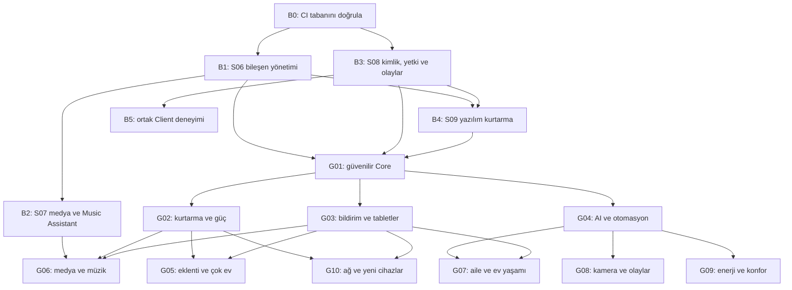

# Larenor — seçilen 60 özelliğin uygulama sırası

**Karar: 5 Eylül 2026 · 60/60 seçildi · Yeni özellik kabulü: 0/60.**

Kullanıcı 01–60 arasındaki özelliklerin tamamını seçti. Bu belge onları mevcut
S01–S09 ve ürün kuyruğuna bağımlılıklarıyla ekler. Her F numarası araştırmadaki
aynı numaradır. Başlık, Core/Android sorumluluğu, gereksinim, efor ve birincil
kaynaklar [60 özellik kataloğunda](feature-candidates-2026-09-05.md), seçim
kaydı [JSON dosyasında](feature-candidates-2026-09-05.json) korunur.

**Durum:** Aşağıdaki 60 satırın tamamı **planlandı**. Mevcut altyapıdan yararlanan
satırlar da kendi kabul koşulları doğrulanmadan tamamlanmış sayılmaz. Önceki
kapsamın yaklaşık %65 tahmini yeni genişlemenin yüzdesi değildir. Yeni toplam
için ölçülmüş efor bulunmadığından birleşik yüzde henüz hesaplanmıyor.
[PROGRESS](PROGRESS.md) uygulama ve test sonuçlarının güncel kaydıdır.

## Uygulama kararları

- Tek Larenor kurulumu ve tablet öncelikli Android Client korunur. Core burada
  sunucu rolüdür; mevcut Larenor Server paketlerini kendiliğinden yeniden
  adlandırmaz. DeX aynı Android uygulamasının yeteneğidir; native iOS kapsam dışı.
- Bileşenleri Server kurar, birbirine bağlar ve denetler; kullanıcı Client'taki
  ayarları yönetir. Sağlayıcı hesaplarının kullanıcı girişleri, donanım ve
  gerekli ağ izinleri kurulum otomasyonundan ayrı koşullardır.
- Seçilmiş olması 60 modülün aynı anda çalışmasını gerektirmez. Modüller
  gereksinimleri doğrulanarak etkinleştirilir; eksik cihaz/hesap açıkça gösterilir.
  Kaynak projeler mimari/API örneğidir; her biri için zorunlu fork veya yeni
  servis kararı verilmiş değildir.
- Tüm yönetim Server'da yetki kontrollü API ve OpenAPI üzerinden Client içinde
  olur. Yeni route, şema veya üçüncü taraf motor bu planla uygulanmış sayılmaz.
- Üretim Home Assistant kontrolleri **salt okunur** kalır. Geliştirmedeki yazma,
  kurulum, güç, kapı ve kamera senaryoları sentetik ortamda sınanır. Ev sunucusu
  kurulumu ve fiziksel kabul en sonda kullanıcıyla manuel yapılır.

## Önce mevcut temelleri tamamla

Bu kapılar S paketlerinin uygulanmış kodunu yeniden yazdırmaz. Genişlemenin
gerektirdiği eksik sözleşmeleri ve doğrulamayı mevcut işin içine yerleştirir.
Bir özellik yalnız bağımlı olduğu kapıları bekler; bütün genişleme S09'un
fiziksel kabulüne kadar durmaz.

| Kapı | Mevcut sıraya yerleşimi | Bitti sayılma ölçütü |
| --- | --- | --- |
| B0 — Doğrulanmış geliştirme tabanı | Mevcut S06 teslimi ve Android CI | Son kodun analiz/birim/native/E2E ve iki mimarili Server CI sonuçları kaydedilir; Quickstep/emülatör hatası kanıtla çözülür. Önceki başarılı koşum yeni head yerine kullanılamaz |
| B1 — Yönetilen bileşen yaşam döngüsü | S06; B0'dan sonra | Docker/port/ağ kontrolü, plan önizlemesi, kurulum/başlatma/durdurma, sürüm/sağlık ve başarısız işten toparlanma. Sahip olunmayan CasaOS servis/verileri otomatik devralınmaz |
| B2 — Bütünleşik medya ve müzik | S07; B1'den sonra | Jellyfin/Seerr/Arr/qBittorrent/Music Assistant için tek kurulum, otomatik servis kimliği/adres/kütüphane bağlantısı ve durum doğrulaması. Ayrı kullanıcı API anahtarı kopyalama akışı yok |
| B3 — Merkezi kaynak, yetki ve olay sözleşmeleri | S08 temeli S06 ile paralel; adaptörler servis servis | Kalıcı home/core/resource kimlikleri, kişi/oda/kaynak yetkisi; komut/sonuç/iz ve veri güncelliği; sıra, tekrar, kopuş, iptal ve idempotence. JSON kontrol API'sinden ayrı sınırlı dosya/medya aktarım yolu |
| B4 — Yeniden kurulum ve kurtarma | S09 yazılım bölümü; B1/B3 ile bütünleşir | Veritabanı, anahtarlar, yapılandırma ve dahili bileşen sürümlerinin tutarlı yedeği; boş test kurulumuna doğrulanmış geri yükleme; kesilmiş aktarım ve şema uyumsuzluğunda koruma |
| B5 — Ortak Client deneyimi | Mevcut ortak tasarım; her teslimde | Kaynak/oda/kişi kimliğiyle arama ve gezinme; aynı kart/form/durum dili, erişilebilir tablet düzeni, yetkiye göre görünürlük ve hesap değişiminde temizleme. Yeni sayfalar buraya bağlanır |

S06'nın şu anki salt okunur işçisi B1'in tamamı değildir. B3'ün kimlik/yetki
temeli erken hazırlanır; HA, medya ve ağ adaptörlerinin taşınması kendi
doğrulamalarıyla sürer. Bir MiB sınırındaki mevcut bağlantı kontrol transportu
büyük medya dosyaları için büyütülmez; akış, aralık isteği, iptal ve aktarım
kotaları ayrı yoldadır. Çok evli kullanımın tam arayüzü F19'da olsa da kaynak
kimlikleri ve evler arası yalıtım B3 şemasından itibaren korunur.

B1'in CPU/GPU/bellek/disk/ağ bütçesi tüm işlere ortaktır; F08 bunun AI model ve
öncelik yönetimini genişletir. B3'ün içerik politikası izin değişimi/silmenin
dosya, indeks, önbellek, dışa aktarım ve yedeğe etkisini baştan tanımlar.
Beyaz tahtanın çevrimdışı birleşimi, stok/para/rezervasyonun Server işlemleri
ve fiziksel komutların tekrar davranışı farklı sözleşmelerdir.

Donanım sürprizlerini erken görmek için B0–B3 sırasında GMS'siz bildirim,
Device Owner, DeX ikinci ekran, kamera model mimarisi ve oyun yayını native
yolu için küçük kavram kanıtları hazırlanır. Bunlar özellik kabulü değildir;
mevcut ortamda ölçülemeyen koşullar cihaz kabul listesinde açık kalır.

## Bağımlılık haritası

Harita grupların genel ilişkisini gösterir; satırdaki F/B bağımlılıkları kesin
geliştirme önkoşuludur. **B0 ve B5 bütün satırların ortak teslim kapısıdır.**
Gruplar öncelik sırasıdır; aynı grupta veya farklı grupta önkoşulları biten
bağımsız satırlar paralel ilerleyebilir. Örneğin tarif merkezi bütün AI
paketini, parti kuyruğu da sesli kitap özelliğini beklemek zorunda değildir.

## G01 — Güvenilir Core ve izlenebilir işlemler

İlk yeni teslim. Yetki, ağ sınırı ve neden/sonuç izleri sonraki bütün modüllerin
ortak temelidir. Kimliklerin B3'te hazırlanması ile işlem günlüğünün F20'de
genişletilmesi ayrı işlerdir.

| ID | Özellik | Önkoşul | Özelliğe özgü kabul |
| --- | --- | --- | --- |
| F13 | Bileşen bazında internet izinleri | B1, B3 | İzinli/engelli hedef politikası gerçek bağlantı yolunda uygulanır; DNS/redirect/yeniden bağlanma sınanır. LAN keşfi ve medya trafiği için gereken dar istisnalar görünürdür |
| F15 | Doğrulanabilir bileşen güncellemeleri | B1, B4 | İmaj/paket kimliği ve kökeni politika ile doğrulanır; yanlış imza, değişmiş içerik ve izin verilmeyen sürüm reddedilir. Veritabanı geçişi geri dönüş planıyla sınanır |
| F20 | Değiştirilmesi fark edilen işlem günlüğü | B3, B4 | Kayıt zincirinde değişiklik/kopma fark edilir; kontrol noktası ayrı korunur. Tüm yetkilere sahip saldırgana karşı mutlak değiştirilemezlik iddia edilmez |
| F06 | Bunu kim, neden yaptı? | B3 | Kullanıcı/kural/servis/komut/sonuç bağı aynı iz kimliğiyle gösterilir; sebebi bilinmeyen olay için zaman yakınlığından neden uydurulmaz. F20 bu izlerin bütünlük korumasını ayrıca genişletir |
| F05 | Uzun süren ev iş akışları | B1, B3, F06 | Restart, zaman aşımı, iptal ve insan kararı beklemesinden devam; belirsiz fiziksel komut körlemesine tekrarlanmaz, kullanıcıya uzlaştırma sonucu sunulur |

## G02 — Kurtarma, yedek koruması ve güç

F16 test kurulumunda otomatik çalışabilir. F17 gerçek korumalı yedek hedefi,
F18 ise uyumlu UPS/veri kaynağı sağlandığında fiziksel kabul kazanır.

| ID | Özellik | Önkoşul | Özelliğe özgü kabul |
| --- | --- | --- | --- |
| F16 | Otomatik kurtarma tatbikatı | B4, F05 | İzole boş ortama yedek açılır; veritabanı, anahtar ve bileşen sağlık kanıtı raporlanır. Tatbikat üretim otomasyonlarını çalıştıramaz |
| F17 | Yedekleri silmeye kapalı kurtarma hedefi | F16 | Günlük yedek kimliği mevcut yedeği silemez; saklama/kurtarma yetkisi ayrılır. Yanlış politika ve erişim iptali testleri, hedefe özgü kabul |
| F18 | Elektrik kesintisinde düzenli kapanış | F05, F16 | UPS olayında indirmeler/işler, veritabanı ve sunucu sırası korunur; sahte/tekrarlı olay ve enerji dönüşü sınanır. Gerçek kapanış ayrıca manuel kabul edilir |

## G03 — Erken bildirim, tablet ve ev görünümü

GMS'siz bildirim ve tablet yönetimi günlük kullanım için erken gelir. Huawei
MatePad, diğer Android tabletler ve DeX ayrı cihaz kabul kayıtlarına sahiptir.

| ID | Özellik | Önkoşul | Özelliğe özgü kabul |
| --- | --- | --- | --- |
| F54 | Google servislerinden bağımsız bildirim | B3, F05 | Kayıp/tekrar/yeniden bağlantı, bildirim izni ve güvenli hedefe dönüş sınanır; hassas içerik kilit ekranında korunur. OEM güç kısıtları ve gerekebilen sürekli servis bildirimi cihazda doğrulanır |
| F53 | Evdeki tabletleri tek yerden yönetme | F54, F13 | Kayıt/iptal, profil sürümü, kalp atışı ve komut sonucu; yanlış ev veya iptal edilmiş tablet işlem alamaz. Normal uygulama ile Device Owner yetenekleri ayrı gösterilir |
| F51 | Etkileşimli ev kat planı | B3 | Oda/cihaz yerleştirme, ortak kimlikle canlı durum ve yetkili eylem; erişilebilir liste alternatifi, ölçek/dokunma ve hesap değişimi |
| F52 | DeX'te iki ekrana farklı görev | B3 | Aynı Android uygulamasında iki ekran rolü, yön/değişken pencere ve hot-plug; odak/oynatıcı sahipliği korunur, özel içerik yanlış ekrana taşınmaz. Kat planı isteğe bağlı ekran içeriğidir |

## G04 — AI ve denetlenebilir otomasyon

Önce kaynak bütçesi ve yan etkisiz değerlendirme, sonra konuşarak taslak.
Yerel model/işlem kapasitesi ve ses için STT/TTS özellik bazında doğrulanır.

| ID | Özellik | Önkoşul | Özelliğe özgü kabul |
| --- | --- | --- | --- |
| F08 | Yapay zekâ kaynak yöneticisi | B1, B3, F05 | Bellek/işlem/iş kuyruğu kotası ve öncelik; medya aktifken yük azaltma, iptal ve donanım yetersizliğinde açık durum. Gerçek yük ölçümü ayrıca kaydedilir |
| F04 | Çakışan kurallar hakemi | B3, F06, F05 | Aynı cihazda eşzamanlı kurallar, süreli sahiplik ve elle müdahale tutarlı çözülür; Core dışındaki HA yazmaları ayrı gözlenir, kontrol ediliyormuş gibi gösterilmez |
| F02 | Otomasyonun deneme haftası | F04, F06 | Gerçek/sentetik olayları değerlendirirken adaptöre sıfır yazma; tetiklenen/bastırılan karar raporu, zaman dilimi ve saat değişimi testleri |
| F03 | Geçmişte otomasyon sınaması | F02, F06 | Sürümlü olay/kuralla deterministik tekrar ve karar farkı; eksik geçmiş bilinmeyen kalır, canlı cihaz veya canlı kuyruğa yazılamaz |
| F01 | Konuşarak otomasyon taslağı | F08, F02, F03, F04 | İzinli eylem kataloğundan şema doğrulanan taslak; hedef/adım/yan etki önizlemesi ve etkinleştirme onayı. Prompt enjeksiyonu veya model metni doğrudan komut çalıştıramaz |
| F09 | Görülebilir, süreli AI hafızası | F08, F20 | Kaynak/kullanıcı/süre açıklaması, düzeltme ve silme; indeks/önbellek dahil unutma ve hesap yalıtımı. Yedek geri yüklemede silinmiş tercihler yeniden etkinleşmez |
| F07 | Evin alışılmış düzeninden sapmalar | F06, F08 | Yeterli örnek ve veri tazeliği koşulu; yanlış alarm/normal işaretleme ve model sürümü. Eksik veri normal veya anomali diye kesinleştirilmez |
| F10 | Kanıta dayalı arıza yardımcısı | F06, F08 | Her teşhis kaynağa/ölçüme bağlanır; bilinmeyeni açıklar, sırları çıktıdan çıkarır. F07 anomali bulguları ek kaynak olabilir; onarım önerisi ayrı önizleme ve mevcut işlem yetkisini gerektirir |

## G05 — Genişletilebilirlik, destek ve birden fazla ev

F11/F12 ortak sınırlı yetenek sözleşmesini kullanır; MCP için mini eklenti
çalıştırıcısı zorunlu değildir. F14 bir internet portunu
kendiliğinden açmaz. F19'un kimlik temeli B3'tedir; bu dalga ev seçimi, bağlantı
ve yetki yönetimini tamamlar.

| ID | Özellik | Önkoşul | Özelliğe özgü kabul |
| --- | --- | --- | --- |
| F11 | Sınırlı yetkili mini eklentiler | F13, F15, F20, F05 | API yetenek listesi, dosya/ağ/CPU/bellek sınırı ve durdurma; eklenti diğer evin verisine, anahtarlara veya sınırsız host yönetimine erişemez |
| F12 | Yetkili MCP kapısı | B3, F13, F20 | Kullanıcı/istemci bazında araç yetkisi ve süre; iptal edilen token veya prompt kaynaklı yönlendirme yetkiyi aşamaz. Yazmalar aynı önizleme/sonuç yoluna girer |
| F14 | Süreli destek oturumu | F13, F20, F54 | Açıkça verilen dar yetki, süre sonu/elle iptal ve görülebilir oturum; log maskeleme, bağlantı kopuşu ve yetki yükseltme reddi |
| F19 | Birden fazla ev, bağımsız Core | B3, B4, F16, F20, F54 | Ev değişiminde veri/token/arama/önbellek yalıtımı; her Core çevrimdışı bağımsız işler. Evler arası hareket ayrı yetkiyle, geri yükleme kimlik çakışmalarıyla sınanır. F17 hedefi ayrıca bağlanabilir |

## G06 — Medya ve müzik

B2'nin otomatik bağlantısı üzerine eklenir. Sağlayıcı ve alıcı yetenekleri
kaynak/sürüm bazında gösterilir; HomePod/AirPlay ve Cast aynı protokol veya
aynı video yeteneğine sahip kabul edilmez. Yasal medya kaynağı ve sağlayıcı
yetkisi gereken yerde kullanıcı hesabıyla doğrulanır.

| ID | Özellik | Önkoşul | Özelliğe özgü kabul |
| --- | --- | --- | --- |
| F24 | Akıllı altyazı ve dil tercihleri | B2, B3 | Kişi tercihleri mevcut altyazı/ses parçalarıyla eşlenir; eksik ses parçası bulunmuş sayılmaz. Jellyfin/oynatıcı seçimi ve altyazı motoru ayrı sözleşmelerle sınanır |
| F26 | Oynatma kalitesi danışmanı | B2, B3, F06 | Codec/bitrate/ağ/alıcı kanıtıyla direct play/remux/transcode açıklaması; eksik telemetri açık durum, ölçümsüz kalite garantisi yok |
| F25 | Jenerik ve kapanış atlama | B2, B3 | Kaynak işaretlerini doğrulama, zaman sınırı, isteğe bağlı atlama; yanlış/eksik işaret ve farklı sürümde güvenli davranış |
| F21 | Birlikte senkron film izleme | B2, B3 | Oda/katılımcı yetkisi, lider değişimi, gecikme ve yeniden katılma; farklı alıcı yetenekleriyle ölçülen senkron toleransı kabul öncesi belirlenir |
| F22 | Kendi televizyon kanalların | B2, F05 | İzinli kütüphaneden yayın akışı, program rehberi ve yeniden başlatma; silinmiş/erişilemeyen içerik için açık boşluk/yeniden planlama |
| F23 | Canlı TV ve kayıt merkezi | B2, B3, F05 | Yetkili tuner/IPTV/EPG kaynağı, saat dilimi ve çakışan kayıtlar; disk kotası, kesilme ve kayıt yeniden başlatma. F22'nin kişisel kanal motoru zorunlu değildir |
| F27 | Seyahat için çevrimdışı medya | B2, B3, B4 | İzinli indirilebilir içerik, alan/kota, kesilmeden devam ve bütünlük; hesap çıkışı/lisans süresi/cihaz değişiminde erişim. Sağlayıcı DRM kuralları aşılmaz |
| F28 | Sesli kitap ve podcast merkezi | B2, B3 | Bölüm/ilerleme/yer imi/uyku zamanlayıcısı; oturumlar arası çakışma ve MediaSession/arka planda devam. Sağlayıcı/format kapsamı görünürdür |
| F29 | Parti DJ'i ve ortak şarkı oylaması | B2, F54 | Music Assistant kuyruğu, kullanıcı başına oy ve sınır; eşzamanlı ekleme/atlama, katılımcı ayrılması ve bağlantı kopuşunda tutarlılık |
| F30 | Medya arşivi sağlık ve yer tasarrufu | B2, F16, F05, F08 | Bozuk/çift dosya ve dönüştürme önerisini kanıtla gösterme; önizleme, korunan orijinal, ortak kaynak kotası ve başarısız işten kurtarma. İnceleme otomatik silmeye dönüşmez |

## G07 — Aile ve ev yaşamı

Tarif/stok ve envanter/belge alt grupları paralel yapılabilir. Fotoğraf AI'sı
F08'i bekler; temel aile işlerini geciktirmez. Kişisel belgeler, sağlık,
fotoğraflar ve harcamalar ortak duvar ekranına varsayılan olarak açılmaz.

| ID | Özellik | Önkoşul | Özelliğe özgü kabul |
| --- | --- | --- | --- |
| F31 | Haftalık menü ve tarif merkezi | B3 | Porsiyon/birim, menü ve alışveriş listesi bağlantısı; tekrar ekleme, Türkçe içerik ve kişi yetkisi |
| F32 | Dolap stoğu ve son kullanma takibi | F31 | Birim/lot/tarih ve stok hareketleri; eşzamanlı tüketim, tekrar okutma ve geri alma tutarlılığı |
| F33 | Büyük ekran pişirme asistanı | F31, F32 | Adım, çoklu zamanlayıcı, malzeme düşümü; tablet yön/pencere değişimi ve uygulama dönüşünde süre korunur |
| F34 | QR etiketli ev envanteri | B3 | Sabit envanter kimliği, oda/cihaz/belge bağlantısı; bozuk/yabancı QR komut çalıştırmaz, yetkisiz öğe okunmaz |
| F35 | Ev belgeleri ve garanti hatırlatmaları | F34, F05, F08 | Dosya aktarımı/OCR, garanti tarihi ve hatırlatma; yanlış OCR düzeltilebilir, ortak kaynak kotası ve özel belge/silme/yedek ilkeleri korunur |
| F36 | Adil ev işi paylaşımı | F05, F54 | Tekrar eden görev, kişi sırası ve erteleme; saat dilimi, kullanıcı ayrılması ve tamamlandı bildiriminin tekrarları |
| F37 | Ortak ev masrafları | B3, F20 | Para birimi/yuvarlama ve paylaştırma; düzenleme geçmişi, yetki ve dışa aktarım. Banka bağlantısı veya ödeme gerçekleştirme bu satırın kapsamı değildir |
| F38 | Aile anıları ve fotoğraf araması | F08, F16, F13 | Dosya/bütünlük/kota, albüm yetkisi ve indeks silme; yüz etiketleme ayrı açık izinle. Orijinal ve indeksin geri yükleme koşulları doğrulanır |
| F39 | Canlı aile panosu ve beyaz tahta | F54 | Eşzamanlı düzenleme, çevrimdışı birleştirme, geçmiş ve öğe yetkisi; büyük pano sınırı ve yeniden bağlantı |
| F40 | Ortak kaynak rezervasyonu | F05, F54 | Zaman dilimi/çakışma, kapasite ve iptal; aynı kaynağı eşzamanlı ayırma tek tutarlı sonuç üretir |

## G08 — Kamera ve olaylar

Önce kayıt/mahremiyet profili, sonra paylaşım ve AI. Kamera sensörleri kapı
açma, yönetici veya sağlık erişimi için tek başına kimlik kanıtı sayılmaz.

| ID | Özellik | Önkoşul | Özelliğe özgü kabul |
| --- | --- | --- | --- |
| F43 | Evdeyken kamera kayıt profili | B3, F13, F20 | Desteklenen kayıt/algılama ayarlarının sonucu geri okunur; başarısız kısmi değişiklik görünürdür. Profil mikrofonu veya kameranın diğer kayıt sistemlerini kapattığını iddia etmez |
| F42 | Mahremiyet korumalı olay paylaşımı | F43, F20 | Maskeleme ve metadata temizliği çıktıda doğrulanır; alıcı/süre/iptal kontrollü paylaşım. Orijinal kayıt herkese açık hale gelmez |
| F41 | Kamera kayıtlarında doğal dille arama | F43, F08 | İzinli klip/olay indeksleriyle sonuç ve zaman bağlantısı; silinen klip indeks/önbellekten çıkarılır, yanlış sonuç düzeltilebilir. Dışa paylaşım F42'nin ayrı yeteneğidir |
| F44 | Kameradan görsel sensörler | F43, F08 | Model/sürüm, güven ve veri tazeliği; yanlış/eksik kare durumu. Seçilen motorun eğitim/çalıştırma donanım gereksinimi, AVX/AVX2 ve ARM64 desteği ayrıca doğrulanır |
| F45 | Havlama ve gürültü olayları | F43, F54, F08 | Açık ses işleme izni, olay/süre/yanlış alarm sınırı; ham ses saklama tercihi, iptal ve gizlilik. Sessiz veri gelmemesi sessizlik kanıtı sayılmaz |

## G09 — Enerji, iklim ve bahçe

Önce gözlem ve öneri, sonra desteklenen cihazlar üzerinde onaylı kontrol.
EV, güneş/batarya, vana/pompa ve güç ölçeri bulunmayan evlerde ilgili modül
kurulu/çalışıyor gibi sunulmaz. Tasarruf miktarı ölçülmeden vaat edilmez.

| ID | Özellik | Önkoşul | Özelliğe özgü kabul |
| --- | --- | --- | --- |
| F50 | Oda konforu ve havalandırma planı | B3, F04 | Sıcaklık/nem/CO2 ve desteklenen iklim cihazı ayrı kaynaklarla doğrulanır; pencere/açık sensör/eksik veri ve elle müdahale davranışı |
| F48 | Ev güç bütçesi | F04, F06 | Taze sayaç verisi, yük önceliği ve salınım önleme; kritik yükler korunur, iletişim kaybında belirlenmiş cihaz davranışı ve manuel kontrol |
| F46 | Elektrikli araç şarj planlayıcısı | F48, F05 | Desteklenen şarj cihazı, ayrılış hedefi ve güç sınırı; bağlantı/saat/tarife kesintisi, iptal ve manuel üstüne alma |
| F47 | Güneş ve ev bataryası öncelikleri | F48, F03 | İnverter/batarya kabiliyeti ve minimum rezervle geçmişte sınama; eksik tahmin/veri, kapasite sınırları ve manuel tercih. EV bulunması şart değildir |
| F49 | Bahçe sulama ve su bütçesi | F04, F05, F54 | Bölge/süre/yağış ve vana/akış kanıtı; bağlantı kesilmesi, akış yokluğu, günlük kota ve güvenli durdurma |

## G10 — Ağ, varlık algısı ve yeni cihazlar

Modeller öğrenildikçe cihaz başına yetenek/kabul matrisi doldurulur. Donanım
satın alma, firmware yükleme veya var olan ev ayarını değiştirme bu plan
güncellemesinin parçası değildir.

| ID | Özellik | Önkoşul | Özelliğe özgü kabul |
| --- | --- | --- | --- |
| F55 | Zigbee/Thread ağ ve güncelleme merkezi | B1, B3, F15, F16 | Önce Zigbee topolojisi/sağlık ve desteklenen OTA; Thread teşhisi ayrı. Koordinatör yedeği, başarısız OTA ve model yeteneği; her Matter/Thread cihazı güncellenebilir varsayılmaz |
| F56 | Eski cihazlar için akıllı kumanda | B3, F06 | Uyumlu IR köprüsü, tuş/öğrenme ve komut makbuzu; geri bildirim yoksa cihazın açıldığı kesinleştirilmez |
| F57 | Oda düzeyinde yerel varlık algısı | B3, F13 | Yerel beacon/alıcı eşlemesi, kişi izni, kalibrasyon ve geçiş histerezisi; odada bulunmak kimlik doğrulaması veya kapı açma yetkisi sağlamaz |
| F58 | E-paper mini ev ekranları | B3, F53, F54 | Uyumlu etiket/köprü, şablon, yenileme ve pil/son temas; ilk kapsam ortak ve hassas olmayan içerik. Kopuk ekran son görüntüyü koruyabilir; uzaktan silindiği varsayılmaz |
| F59 | 3D yazıcı ve atölye merkezi | F05, F54 | Desteklenen yazıcı API'siyle iş/ısı/durum izleme ve onaylı duraklatma/iptal; iletişim kopması cihazda doğrulanır. İlk kapsamda keyfi G-code veya baskı başlatma yok |
| F60 | Tablette ev bilgisayarından oyun yayını | B3, F13 | Uyumlu host eşleme ve Android oynatma/girdi yolu; dokunma/gamepad, gecikme ve kopuş. F52/F26 ek iki ekran/kalite bütünleştirmesidir; host/GPU/codec/oyun yetkisi ayrıca doğrulanır |

## Her teslimin tamamlanma kapısı

Yeni modül yalnız bir API veya boş ekran teslimiyle bitmez. Her satırda şu
kayıtlar PROGRESS ve [test matrisine](testing-matrix-2026-09-05.md) bağlanır:

1. **Core:** Sürümlü veri/API sözleşmesi, migration/geri alma, yetki, kota,
   iptal/idempotence, sır maskeleme ve gerekli iş/olay yaşam döngüsü.
2. **Client:** Ortak arama/oda/kişi bağlantısı; kurulum/boş/bekliyor/hata/eski
   veri/başarı durumları; tablet, klavye/TalkBack, hesap/PIN/arka plan sınırları.
3. **Birim ve entegrasyon:** Karar mantığı, kalıcılık/restart, yetki reddi,
   upstream sözleşme fixture'ları, sürüm farkı, bozuk/geç/kısmi yanıt testleri.
4. **E2E:** Gerçek Client → yerel test Core → sentetik servis zinciri; en az
   başarılı kullanıcı yolu ve önemli başarısızlık/kurtarma yolu. Yetkisiz kişi,
   ev değişimi, ağ kopması veya eski onayın tekrar kullanımı riskine göre eklenir.
5. **Performans ve security:** İş kuyruğu/bellek/aktarım/disk sınırı; saldırgan
   dosya/model/eklenti girdisi; log/indeks/yedek gizliliği ve bağımlılık taraması.
   Cihaz FPS/pil veya ağ gecikmesi, yalnız birim testiyle kanıtlanmış sayılmaz.
6. **CI ve kabul:** Testleri modül geldiğinde mevcut workflow'a ekleme; tam
   head'in başarısı ve gerekiyorsa gerçek donanım/hesap kabulü. Çalışmayan veya
   credential eksik testi sessiz başarıya dönüşmez; fiziksel kabul ayrı kalır.

CI'a bugün uygulanmamış modüller için sahte yeşil test veya boş senaryo
eklenmez. Bu plan değişikliğinde ID bütünlüğü, bağımlılık sırası ve belge
bağlantıları doğrulanır; özellik testleri gerçek kod dilimiyle birlikte gelir.

## Mevcut kalan işleri ve son teslimi koru

S06–S09, otomatik medya bağlantıları, mevcut Apple TV/HomePod ve müzik
sağlayıcısı kabulü, ileri Fully Kiosk, sağlık izinleri, Netelsan Algan 7
köprüsü ve diğer mevcut açıklar yeni liste yüzünden kuyruktan düşmez.
Her modül ortak tasarım kurallarıyla geliştirilir. Tüm seçili yazılım
dilimlerinden sonra paneller arası son Apple Home esintili tablet düzeni,
akış/performance/security denetimi ve gerçek ekranlardan README görselleri
tamamlanır. **Unus Lar, omnem domum servat.** tek slogan olarak korunur.

Sonra kullanıcıyla manuel CasaOS/Proxmox kurulumu, sağlayıcı girişleri,
güncelleme/yeniden kurulum, MatePad/DeX ve fiziksel ev cihazları kabulü yapılır.
Donanımı veya hesabı bulunmayan seçili modül, eksik koşulu belirtilerek açık
kalır; bütün ürün için yüzde yüz fiziksel uyumluluk iddiasına dönüştürülmez.

**Bir sonraki somut iş:** B0/S06'nın son CI kanıtını kapat; ardından B1 gerçek
gereksinim/kurulum yaşam döngüsü ve B3 ortak kimlik/yetki/olay temeli üzerinde
paralel ilerle. G01 ilk yeni özellik grubu, B2 bütünleşik medya ise mevcut
kuyruğun ana teslimidir. Yeni seçim istemeye gerek yok; 60 özellik onaylıdır.
