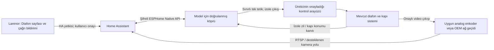

# Netelsan Algan 7 diafon entegrasyonu: donanım temeli ve uygulama planı

Tarih: 2026-09-05. Kullanıcı iç ünitenin modelini **Netelsan Algan 7** olarak bildirdi. Alt ürün kodu, üretim revizyonu, EQMAX/Plus ayrımı, bina giriş paneli ve mevcut bağlantı henüz doğrulanmadı. Bu belge resmi kaynak araştırması ve tasarım şartnamesidir. Canlı Home Assistant'a yazılmadı; kapı açma, firmware yükleme, kamera/mikrofon açma, kablo veya cihaz ayarı değişikliği yapılmadı.

## Algan 7 için sonuç

Resmi belgelerdeki klasik Algan ailesi, **dijital adresleme/çağrı kontrolü ile analog video yolunu birlikte kullanan çok iletkenli bir sistem** olarak ele alınmalı. “Dijital panel” ifadesi görüntünün IP/RTSP olduğu anlamına gelmiyor. Bu sınıflandırma ürün açıklaması ve bağlantı çizimlerinin birlikte yorumlanmasıdır; internette belgelenmiş bir açık Algan bus protokolü bulamadım.

| Kanıt | Doğrulanan bilgi | Entegrasyon kararı |
| --- | --- | --- |
| [Resmi Algan 7 siyah ürün sayfası](https://netelsan.com.tr/urun/goruntulu-diafon-sistemleri/algan-7-handsfree/algan-7_tTOGBN) | Beş iletken + koaksiyel düzeni; dijital panel veya buton çözücüyle analog panel; analog kamera desteği, AHD/IP kameranın bağlanamayacağı açıklanıyor. | Klasik Algan'ı 4+n sesli diafon, genel iki telli bus veya doğrudan IP kamera sanmamak. |
| [Algan bağlantı şeması, H.M.BSM.00064_R00, s.1–2](https://netelsan.com.tr/flmngr/files/katalog/algan-baglanti-semasi.pdf) | Ayrı haberleşme/besleme/video hatları ve daire adres kodlaması var. | Görüntü, zil ve kapı açma için aynı adaptör davranışı varsayılamaz. Hat isimleri GPIO veya röle bağlantı talimatı değildir. |
| [Algan kullanım kılavuzu, H.M.KLV.00043_R02, s.1](https://netelsan.com.tr/teknik-dokuman/hmklv00043r02-algan-montaj-ve-kullanma-kilavuzu_1717760948.pdf) | Kapı tuşu görüşme sırasında kapıyı açar; beklemede kamera gezdirir. | İç ünitedeki tuşa tek darbe her durumda kapı açmaz. Gerekirse aktif kapı/konuşma oturumu ayrıca doğrulanmalıdır. |
| [EQMAX Algan 4.3–7 kılavuzu, H.M.KLV.00130, s.1–3](https://netelsan.com.tr/teknik-dokuman/hmklv00130eqmax-algan-74_1769599246.pdf) | Ayrı cihaz menüsü, daire/dubleks adresi ve analog çevre kamera modülü anlatılıyor. | EQMAX eski Algan ile aynı revizyon değildir; işletim/kurulum ayrımı model profiline taşınmalı. |
| [EQMAX video dağıtıcı şeması, H.M.BSM.00093, s.1](https://netelsan.com.tr/teknik-dokuman/hmbsm00093eqmax-buatici-video-dagitici-baglanti-semasi_1775647039.pdf) | Algan şubeleri, aktif video dağıtımı/sonlandırma ve normal/akıllı kilit için farklı yollar gösteriliyor. | Koaksiyel kabloya pasif bir ayırıcı takmayı veya tek kilit bağlantısını evrensel yöntem saymamak. |

**Resmi kaynaklar kendi aralarında da tutarlı değil.** [Beyaz EQMAX Algan 7 pazarlama sayfası](https://netelsan.com.tr/urun/bina-iletisim-sistemleri/goruntulu-diafon-sistemleri/eqmax-algan-7/algan-7) Wi-Fi erişiminden bahsediyor; incelenen montaj kılavuzunda Wi-Fi eşleştirme, yerel API, SIP veya RTSP sözleşmesi yok. Siyah sayfanın ürün kodu ile [resmi uyumlu model listesi](https://netelsan.com.tr/teknik-dokuman/netelsan-goruntulu-iletisim-sistemleri) arasındaki Plus/renk sınıflandırması da örtüşmüyor. Dolayısıyla kullanıcının ünitesinde Wi-Fi veya API bulunduğu iddia edilemez; **etiket ürün kodu ve revizyona ait üretici belgesi** karar verir.

Video için doğrulanan sınır **analog, AHD/IP olmayan yol**. Kompozit/CVBS yakalama araştırılması makul; ancak PAL/NTSC, seviye, empedans, sürekli/anahtarlanan görüntü ve güvenli çıkış noktası mevcut ünitede doğrulanmadan belirli bir enkoder seçilmez. Resmi belgelerin “analog” sözcüğünü doğrudan ölçülmüş CVBS sinyali diye sunmuyoruz.

## Türkiye'deki sistemler için genişletilebilir sınıflandırma

Uyumluluk marka adına göre değil `üretici + model + revizyon + panel + topoloji + doğrulanmış adaptör` bileşimine göre tutulmalı.

| Sınıf | Teknik ayrım | Larenor adaptör yolu |
| --- | --- | --- |
| Geleneksel 4+n sesli analog | Ortak ses/besleme işlevleri ve daireye özgü çağrı hattı; her üreticinin pin düzeni farklı olabilir. | Yalnız ilgili modelin servis onayıyla izole çağrı girişi ve tetik çıkışı. [Audio resmi 4+n ürün aileleri](https://www.audio.com.tr/wp-content/uploads/2023/03/2023-1-Fiyat-Listesi-WEB.pdf), [ALCAD 4+n sistemi](https://alcadelectronics.com/tr/%C3%A7%C3%B6zeltiler/door-entry-systems-4%2Bn) |
| Çok iletkenli adresli sistem + analog video | Algan belgelerindeki gibi çağrı adreslemesi ile video ayrı yollar izleyebilir. | Üretici arayüzü öncelikli; görüntü için uygun bağımsız dönüştürücü, kontrol için model profili. |
| İki telli bus / iki telli IP taşıyıcı | İki tel bulunması serbest kuru kontak veya bütün markaların aynı protokolü kullandığı anlamına gelmez. | Üreticinin bus/ağ geçidi; gelişigüzel kontak kapatma yok. İki tel üstünden IP kullanan ayrı ürün sınıfı da var. [DNAKE resmi iki telli IP mimarisi](https://dnake-global.com/tr/faqs/2-wire-ip-intercom/) |
| IP/SIP interkom | Ağ taşıması, video, çağrı/ses ve kapı kontrolü ayrı protokoller olabilir. | Belgelenen SIP/WebRTC/RTSP/ONVIF veya üretici API'si; desteklenen özellik başına test. [Multitek resmi SIP monitör örneği](https://online.multitek.com.tr/urun/vip72-7-inc-sip-monitor-akilli-ev-istemiyorum) |

Audio, Multitek, Na-De ve Karel için marka genelinde uyumluluk tanımlanmayacak. Bu araştırmanın önceliği Algan 7; diğer markaların bütün montaj belgeleri taranmış değildir. IP kamera görüntüsünün gelmesi kapı açma veya iki yönlü sesin de çalıştığını kanıtlamaz.

## Önerilen mimari



Bu şema elektrik bağlantı şeması değildir. Bina sistemiyle fiziksel temas kuracak bölüm üretici/yetkili tesisatçı tarafından projelendirilir. Larenor, Android cihazının GPIO/USB üzerinden doğrudan bina hattını sürmesini gerektirmez; tablet yenilenince bina bağlantısı değişmez.

**Tercih sırası:** (1) Netelsan'ın ilgili revizyon için sunduğu resmi gateway/harici açma arayüzü; (2) üretici tarafından doğrulanmış, elektriksel olarak izole yerel adaptör; (3) görüntü ve kontrolü ayrı sağlayan çözümler. Belgelenmemiş bus paketlerini tahmin ederek yayınlama başlangıç yolu değildir. İncelemede klasik Algan için doğrulanmış açık yerel gateway API'si bulunmadı; yokluğu ürünün hiçbir sürümünde gateway olmadığı anlamına gelmez.

### Kontrol ve zil donanımı

- Kuru kontak fikri yalnız **gerçekte kuru kontakla çalıştığı OEM tarafından doğrulanmış tetik girişinde** uygulanabilir. Bu durumda ek çıkış enerjisizken açık kalan NO davranışına sahip olur ve mevcut buton kullanımını korur. Mevcut kapı kilidinin fail-safe/fail-secure niteliği değiştirilmez.
- Algan'ın dokunmatik tuşu iki uçlu mekanik buton varsayılamaz. İç PCB'de lehim, tuş matrisi taklidi veya ortak bus hatlarına paralel röle, üretici teyidi olmadan tasarımın parçası değildir. Kılavuzdaki görüşme/boşta işlev ayrımı ayrıca kontrol edilir.
- Zil girişi doğrudan ESP GPIO'suna bağlanmaz. AC/DC, eşik, akım, toprak ilişkisi ve çağrı tipine göre tasarlanan galvanik izolasyon/uygun arayüz gerekir. Aynı binadaki başka dairenin çağrısı kullanıcıya ait zil diye yorumlanmamalıdır.
- Röle sürme polaritesi, boot pinleri, besleme sıralaması, donanımsal maksimum darbe kesmesi ve röle kontağı kapasitesi kart seviyesinde doğrulanır. Sadece YAML `restore_mode` veya yazılım gecikmesi bir donanım güvenlik garantisi değildir. ESPHome, reset sırasında yazılım başlamadan GPIO'nun röleyi etkinleştirebileceğini açıkça belgeliyor. [ESPHome GPIO sınırı](https://esphome.io/components/switch/gpio/)
- Dış besleme güvenli ve bağımsız olmalı; diafon hattından güç alınabileceği varsayılmaz. İzolasyonu bozan USB/ortak toprak yolu dahil montaj ve kasa kararı elektrik projesine aittir. Şebeke/trafo, kilit beslemesi ve ortak bina tesisatı yazılım görevinden ayrıdır.
- Manyetik kapı kontağı önerilen ayrı geri bildirimdir. `open/closed` kanıtı kilit dilinin durumunu veya açılmanın bizim komuttan kaynaklandığını tek başına kanıtlamaz. Kontak yoksa arayüz “kapı açıldı” sonucunu üretemez.

### Görüntü ve ses

Onaylı analog çıkışı ağa taşıyan video enkoder sınıfı mevcut; örneğin [AXIS P7304 teknik belgesi](https://www.axis.com/dam/public/8a/2d/fa/datasheet-axis-p7304-video-encoder-en-US-455722.pdf) kompozit giriş ve RTSP desteğini belgeliyor. Bu bir **sınıf örneğidir, Algan için satın alma/uyumluluk önerisi değildir**. Kanal sayısı, sonlandırma, seviye, izolasyon, kodlama, gecikme ve Netelsan çıkış onayı görülmeden cihaz seçilmez.

ESP32 kamera modülü kendi desteklediği kamera arayüzü içindir; Algan'ın analog videosunu evrensel olarak alıp dönüştürdüğü varsayılmaz. Özel analog yakalama donanımı yokken iki kabloyu ESP32-CAM'e bağlayan bir tasarım sunulmaz. Alternatif olarak kullanıcının yetkili olduğu bağımsız IP kapı kamerası kullanılabilir; bu, mevcut diafon videosunu dönüştürmekten ayrı seçenektir.

HA kamera yolu RTSP/uygun görüntü kaynağını alabilir. [HA Generic Camera](https://www.home-assistant.io/integrations/generic/) ve [kamera entegrasyonu](https://www.home-assistant.io/integrations/camera/) temel referanstır. İki yönlü ses için analog ses izolasyonu, seviye/empedans, yankı bastırma, yarım/tam çift yön ve oturum yönetimi ayrıca gerekir. `camera` entity veya video akışı otomatik `twoWayAudio` desteği anlamına gelmez.

## Uygulamadaki temel ve eklenecek sözleşme

Mevcut [ActionController](../lib/features/health/data/action_controller.dart) aynı hedefte eşzamanlı eylemi engelliyor; komutları çevrimdışı saklamıyor, tekrar göndermiyor ve bellekle sınırlı durum kaydı tutuyor. [HA eylem yürütücüsü](../lib/features/health/providers/ha_actions.dart) kabul edilen istek ile gözlenen HA durumu ayrımını yapıyor. Bunlar yeniden kullanılmalı; diafon için ikinci genel komut altyapısı kurulmasına gerek yok.

[CameraSnapshot](../lib/shared/widgets/camera_snapshot.dart) şu anda periyodik fotoğraf getiriyor; tarih/eski görüntü işareti ve yaşam döngüsü koruması var. Canlı WebRTC/SIP görüşmesi veya çağrı yakalama değil. Diafon için önce bu sınırlama açık gösterilmeli; sonrasında canlı görüntü oturumu ortak kamera altyapısına eklenmeli.

Önerilen model alanları:

| Alan | Anlam / davranış |
| --- | --- |
| `IntercomProfile` | Üretici, model, revizyon, panel türü ve doğrulama durumu. Hesap/sunucu değişince eski eşleştirmeler kullanılmaz. |
| `CapabilityEvidence` | `unknown`, `unsupported`, `requiresSetup`, `verified`; belge/kurulum kaynağı ve doğrulanma tarihi. Kaydedilmiş ayar başarılı cihaz okuması değildir. |
| `chime` | Doğrulanmış çağrı kaynağı, olay kimliği/zamanı ve debounce; daire önü/bina kapısı ayrımı mevcutsa korunur. |
| `camera` | Snapshot/stream ayrı; son kare zamanı, çağrıya ait kapı/kamera kimliği ve stale durumu. |
| `unlock` | Tam belirli tek hedef, model profili, azami darbe sınırı, canlı köprü, yerel yeniden doğrulama ve açık kullanıcı onayı. |
| `twoWayAudio` | Ancak doğrulanmış oturum adapter'ı varsa açık. Mikrofon varsayılan kapalı, kullanıcı çağrıyı kabul edince izin/oturum. |
| `doorContact` | `open/closed/unknown/unavailable`, ölçüm zamanı ve kaynağı. Kilit durumu ile karıştırılmaz. |
| `callContext` | Hangi giriş, gelen çağrı / elle izleme, çağrı sona erdi mi; eski çağrı yeni kapıya komut taşıyamaz. |

Telefon/tablette tek bir Diafon detay sayfası, aynı veriyle dashboard karosu ve erişilebilir çağrı katmanı yeterli. Zil bildirimi sayfayı açar; hiçbir bildirime dokunma, yüz eşleşmesi, hareket algılama veya deep link kapıyı doğrudan açmaz. Misafir görünümü kapı açma yetkisi kazanmaz. PIN/OS biyometri kullanıcıyı doğrulasa bile HA/köprü tarafındaki yetkinin yerini almaz.

**Kapı açma akışı:** doğru kapı ve güncel kanıt → kullanıcı onayı/yeniden doğrulama → tek gönderim → köprü kabulü → varsa yeni kapı kontağı gözlemi. Timeout/bağlantı kaybında sonuç `unknown` olur; otomatik retry veya reconnect sonrası replay yapılmaz. Yeni deneme yeni kullanıcı kararı ister. Eski `open` snapshot'ı yeni komutu doğrulamaz. Cihazın “darbe tamamlandı” bildirimi fiziksel kapı açılması olarak yazılmaz.

## ESPHome/HA köprü şartnamesi

ESPHome Native API şifrelemesi ve HA'nın Noise PSK desteği kullanılabilir. [Native API](https://esphome.io/components/api/), [HA ESPHome bağlantısı](https://www.home-assistant.io/integrations/esphome/). PSK cihaz bağlantısını korur; HA içinde her kişiye ayrı kapı izni oluşturduğu varsayılmaz. HA kimliği, köprü yetkisi ve uygulama profili ayrı sınırlar olarak tasarlanır. Cihaz internete port açılarak yayımlanmaz; uzaktan kullanım mevcut güvenli HA erişiminden geçer. [ESPHome güvenlik rehberi](https://esphome.io/guides/security_best_practices/)

Bu aşamada çalıştırılabilir GPIO firmware'i yerine aşağıdaki davranış sözleşmesi önerilir. Gerçek pin, polarite, gerilim veya darbe süresi verilmemiştir; bunlar doğrulanmış kart/tesisat profilinden gelmelidir.

```text
Başlangıç durumu: UNCOMMISSIONED; çıkış enerjisiz/açık.
Fiziksel/OEM profil doğrulanmadan komut kabul etme.
Komut: unlock(request_id, session_nonce, expected_door_id).
Kabul şartları: eşleşen aktif oturum, yetki, tek belirli kapı,
  kullanılmamış request_id, meşgul olmayan sürücü, yerel darbe sınırı.
Darbe başladıktan sonra ağdan ikinci bir OFF komutu bekleme.
Yerel süre + bağımsız donanım kesmesi ile çıkışı bırak.
Aktif darbeyi yeni komutla uzatma; kuyruk oluşturma.
Reboot/OTA/brownout/watchdog/bağlantı geri gelişinde darbe üretme.
Önceki boot oturumunun komutlarını kabul etme.
ACK, darbe sonu ve yeni kapı kontağı gözlemini ayrı raporla.
```

Basit HA `button.press` ile başlangıç adaptörü yapılacaksa uygulama tarafı tek gönderim ve cihaz tarafı tek-atımlı/busy sınırı gerekir; tam uçtan uca `request_id`/dedup kanıtı sağladığı iddia edilmez. Daha güçlü sözleşme için sürümlü özel action/bridge ve oturum nonce'u gerekecektir. HTTP/WebSocket'in başarı dönmesi “tam bir defa fiziksel hareket” garantisi değildir.

Rölenin ham `switch.turn_on` kontrolü kullanıcılara açık bırakılmaz. Firmware'in başlangıçta OFF ayarı yardımcı önlemdir, reset öncesi donanım davranışının yerini almaz. [ESPHome switch restore sözleşmesi](https://esphome.io/components/switch/)

## Uygulama sırası ve doğrulama

| İş | Öncelik / bağımlılık | Kabul kriteri |
| --- | --- | --- |
| I00 – Algan profilini kesinleştirme | P0; dışarıdan görülen ürün etiketi/ön yüz ve OEM revizyon belgesi | Classic/EQMAX/Plus, ürün kodu, bina paneli ve onaylı arayüz net. Fotoğraf için kullanıcıdan kapağı açması/kabloya müdahale etmesi istenmez; kişisel daire/seri bilgileri yayımlanmaz. |
| I01 – Diafon domain ve salt okunur kurulum | P0; mevcut HA entity registry/health | Kamera/zil/kapı kontağı hedefleri seçilir; bilinmeyen capability açık gösterilir. Hesap değişiminde eski olay/karşı taraf görüntüsü temizlenir. Kurulum ekranı kendi başına HA entity/automation oluşturmaz. |
| I02 – Fake adapter ve kapı eylemi UI | P0; ActionController | Onay iptalinde sıfır gönderim; çift dokunmada tek gönderim; timeout→unknown; offline/reconnect/back/restore/deep-link ile sıfır tetik. Stale kapı kontağı başarı sayılmaz. Prod hedef kullanmayan fixture testleri. |
| I03 – İzole donanım ve masa testi | P1; I00 + OEM/tesisatçı doğrulaması | Sadece yapay yükle güç aç/kapa, brownout, OTA, watchdog, ağ kesintisi ve yinelenen komutlar test edilir. Başlangıçta sıfır darbe; takılı röle/eksik sensör görünür hata. Yerel maksimum süre fiziksel ölçülür. |
| I04 – Zil olayı ve çağrı katmanı | P1; I01/I03 | Aynı çağrı yinelenmez, eski çağrı resume'da yeni çağrı olmaz. DND, büyük yazı/TalkBack, yatay/DeX ve medya sırasında kontrollü ses azaltma. Mikrofon kendiliğinden açılmaz. |
| I05 – Canlı görüntü | P1; OEM onaylı video çıkışı/enkoder | Doğru giriş/kamera, gecikme ve son kare yaşı görünür; kopmada eski görüntü canlı diye gösterilmez. Enkoder bağlantısı mevcut diafon görüntüsünü bozmuyor. Kamera yetkisi her oturumda kontrol edilir. |
| I06 – Üretim kurulum kabulü | P1; I02–I05 + ayrı kurulum/kapı testi yetkisi | Mevcut manuel diafon/kapı işlevi korunur. Kullanıcının onayladığı kontrollü fiziksel testte olay/ACK/kontak ayrı doğrulanır; sökme/kurtarma yolu kayıtlıdır. Bu araştırma bu testi yapma yetkisi oluşturmaz. |
| I07 – İki yönlü ses | P2; belgeli ses gateway/oturum | Echo/yarım çift yön, çağrı sonu, izin iptali, başka uygulamanın mikrofonu, Bluetooth/DeX ses yolu testleri. Kapı açma bu işe bağımlı tutulmaz. |
| I08 – Diğer marka profilleri | P2; her modele I00/I03 eşdeğeri | Audio/Multitek/Na-De/Karel için model bazlı doğrulama. Başka modelin pin haritası veya marka genellemesiyle destek açılmaz. |

CI'a eklenecekler: saf state-machine/model testleri; fake HA 401/403/timeout/late-ACK; çağrı olaylarında kimlik/zaman tekrarı; profil/hesap değişimi; widget onay/erişilebilirlik; gelecekte firmware lint/config derlemesi ve masa test raporu. Fiziksel röle, hat izolasyonu, video sonlandırması veya gerçek kapı güvenilirliği Flutter unit testinden çıkarılamaz.

İlk somut teslim I01–I02 ile uygulama temelidir; gerçek röle çıkışı profil doğrulaması bitene kadar etkinleştirilmez. Bu, donanım ayrıntıları beklenirken arayüzü ve güvenli eylem davranışını fixture verisiyle tamamlamayı sağlar.

## Bu araştırmanın doğrulama kaydı

Resmi Netelsan ürün/teknik dokümanları, Algan ve EQMAX PDF'leri, ESPHome/HA ve ilgili üreticilerin birincil belgeleri incelendi. Algan bağlantı şeması, EQMAX dağıtıcı şeması ve Algan kullanım sayfası yerelde render edilerek çizimler gözle kontrol edildi. Kaynak PDF'ler depoya kopyalanmadı; ticari şemalar yeniden çizilmedi. Donanım modeli, elektrik ölçümü, kamera formatı veya kapı çalışması fiziksel olarak test edilmiş değildir. Planın eylem/firmware bölümleri mühendislik önerisidir; üretici onaylı montaj belgesi değildir.
