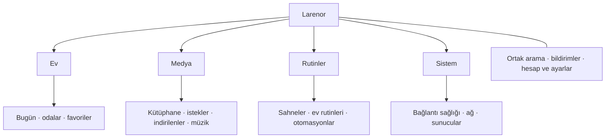

# Larenor — yararlı özellikler ve uygulama bütünlüğü planı

**5 Eylül 2026 · Kullanıcı onayıyla uygulama sürüyor.**

## Uygulama takibi

- [x] 0. Şifreli yapılandırma kasası ve imzalı CI altyapısı — 620 Flutter / 17 Python testi geçti; gerçek cihaz ve ilk signed CI APK doğrulaması bekliyor.
- [ ] 1. Ortak gezinme ve arama — sürüyor.
- [ ] 2. Bağlantı ve işlem durumları.
- [ ] 3. Bugün: listeler, takvim, bildirimler.
- [ ] 4. Medyada istekten oynatmaya ortak aşamalar.
- [ ] 5. Film gecesi rutinleri.
- [ ] 6. Kontrollü oda eşitleme ve kart düzenleme.
- [ ] 7. Enerji ve bakım özeti.
- [ ] 8. Keenetic internet/IP/hız/uptime ve diğer cihazlar için seçilebilir canlı kartlar.
- [ ] 9. Medya hedefleri: Chromecast/Apple TV; doğrulanmış yeteneklerle ortak uzaktan oynatma.
- [ ] 10. Spotify/Apple Music ve HomePod kontrolü için desteklenen sunucu/cihaz yolu.
- [ ] 11. Uygulama içinde müzik merkezi; Music Assistant sunucu motorunun Android uyumluluk değerlendirmesi, üyelik sağlayıcılarının izin verdiği işlevler.
- [ ] 12. Kilit ekranı medya bilgisi/kontrolleri, aktif oynatmada arka plan servisi, bildirim ve güç ayarları.
- [ ] 13. Samsung DeX: değişken pencere boyutu, harici dokunmatik monitör, klavye/fare odağı, çoklu pencere yaşam döngüsü.
- [ ] Son GitHub frontend skill incelemesi, ortak tasarım, test/CI, README ve GitHub doğrulaması.

Aşağıdaki araştırma önerileri bu teslimlerin gerekçesidir. Hesap/Assist ve yeni
Frigate entegrasyonu ayrıca değerlendirilmek üzere sonraki
plan olarak kalır; Music Assistant kullanıcıya göre yayın/müzik yolu için araştırılır; mevcut yedi özelliğin tamamlandığı iddiası değildir.

Bu plan mevcut `140eaae` kodunu, Home Assistant 2026.8.3 ile yapılan önceki salt
okunur doğrulamayı ve resmi ürün/API kaynaklarını temel alır. Değer/efor sıralaması
ürün değerlendirmesidir; kullanıcı araştırması veya cihaz benchmark sonucu değildir.
Üretim Home Assistant üzerinde hiçbir kurulum veya değişiklik yapılmadı.

## Yeni öncelik: ayarları yeniden kurulumda koruma

Kullanıcının tekrar token girme sorunu nedeniyle bu iş, yeni özelliklerden önce
alınmalı. **Henüz uygulanmadı.** İki tamamlayıcı teslim önerilir:

1. **Kaldırmadan güncelleme:** aynı uygulama kimliği ve kalıcı imza anahtarıyla
   APK üretmek; artan sürüm kodu. CI şu anda debug APK üretir, kalıcı signing key
   saklamaz. Bu yüzden güncelleme uyumluluğu ayrıca çözülmeli. Mevcut kurulu
   sürümün imzası ölçülmeden kullanıcıdaki kaldırma gereğinin nedeni kesin
   söylenemez. İmza değişimine geçişten önce mevcut uygulamadan yedek alınmalı.
2. **Yedekle ve geri yükle:** odalar/kartlar/favoriler, tercihler, etkin servisler
   ve kullanıcı seçerse bağlantı token/parolalarını içeren, ayrı güçlü yedek
   parolasıyla şifrelenmiş taşınabilir dosya. Kullanıcı dosyayı sistem Dosyalar
   seçicisiyle uygulama alanı dışında saklar. Yeni kurulumda dosya + yedek parolası
   ile açılır ve sırlar yeni cihazın güvenli deposuna yeniden yazılır. Eski Android
   Keystore anahtarı geri yükleme için gerekmez. Yedek parolası yalnız uygulamanın
   içinde tutulmamalı; unutulursa başka kurtarma anahtarı yokken yedek açılamaz.

İlk sürüm yerel dosya olmalı. Sonraki sürüm aynı şifreli dosyayı NAS/WebDAV veya
kullanıcının seçtiği bulut dosya sağlayıcısına taşıyabilir. Otomatik senkronizasyon
ilk dosya yedeğinin yerine geçmez; kurulum sonrası erişim ve kurtarma ayrıca
çözülmeli. Bu araştırmada token dışa aktarılmadı veya herhangi bir servise yüklenmedi.

**Kapsam:** bilinen yapılandırma alanlarından allowlist; adresler ve tokenlar
aynı servis kaydı içinde bağlı kalır. PIN/deneme sayaçları, WebView çerezleri,
Proxmox geçici ticket/CSRF, loglar ve medya önbelleği yedeğe alınmaz. Yeni cihazda
PIN yeniden belirlenir; Jellyfin cihaz kimliği için aynı kurulum geri yükleme ile
yeni cihaz aktarımı ayrılır. İptal edilmiş veya süresi dolmuş token yedekle
geçerli hale gelmez; o serviste yeniden giriş gösterilir.

**Geri yükleme:** içerik önizlemesi, servis seçimi, mevcut ayarla çakışma kararı,
sürüm/şema doğrulaması; bütün dosya doğrulanmadan hiçbir ayar değiştirilmez.
Uygulama yazmaları durdurulur; yarıda kalan kayıt için kurtarma planı ve sırları
loglamayan hata çıktısı gerekir. Eski bir yedek bekleme süresini kaldırarak mevcut
PIN doğrulamasını aşamamalı; dışa aktarma/geri yükleme ayar kilidinin arkasındadır.

**Kabul testleri:** şifrele–çöz–geri yükle eşitliği; yanlış parola, oynanmış/
kesilmiş dosya ve desteklenmeyen sürümde sıfır değişiklik; boyut/iş maliyeti
sınırları; bozuk/yarım güvenli depo yazmasından toparlanma; yeniden başlatmada
odalar/favoriler/servislerin korunması; farklı cihazda yeni Keystore ile geri
alma; eski token için doğru hata; güncellemede veri korunması. CI'da gerçek
üretim tokenları kullanılmaz. Android emulator ile kaldır–kur–dosyadan geri al
senaryosu, gerçek cihaz testiyle tamamlanmalı.

[Android güncelleme koşulları](https://developer.android.com/google/play/app-updates),
[Android kalıcı kullanıcı belgeleri](https://developer.android.com/training/data-storage/shared/documents-files),
[flutter_secure_storage yedekleme açıklaması](https://pub.dev/packages/flutter_secure_storage)

## Ana karar

Yedekleme ve güncelleme sürekliliğinden sonra en yüksek getiri **ortak gezinme + tek arama + güvenilir veri
ve işlem durumu**. Bunların üzerine günlük ev işlerini eklemek, mevcut on bir dış
servisi daha kullanılabilir kılar. Yeni entegrasyonlar aynı yapıya sonradan katılır.

Mevcut güçlü temeller: ortak Apple Home esintili tema, tek Latin slogan ve logo,
yerel odalar, HA dinamik servis kataloğu, medya kimlik indeksi, seri polling,
yoğun olay birleştirme, PIN, genişletilmiş test/CI paketi. Bunlar yeniden yazılmaz.

Kodda kalan bütünlük boşlukları:

- Ana router üç kök hedef tanıyor: ev, medya, ayarlar. Günlük servis ekranlarının
  önemli kısmına Ayarlar üzerinden gidiliyor; oda/filtre/ayrıntı durumları ortak
  route modeliyle temsil edilmiyor.
- Entegrasyon yönetimindeki `connected` değeri kayıtlı bağlantının varlığına
  dayanıyor; güncel bir sunucu erişim testi değil. Medya servislerinin bazı
  başarısızlıkları boş listeye dönüşebiliyor.
- Oda/cihaz seçicileri, medya araması ve HA eylem araması ayrı. Ortak arama yok.
- Odalar yerel tutuluyor; HA alanıyla isteğe bağlı kalıcı eşleştirme yok.
- Medya kimlik ve kullanılabilirlik temeli var; istekten oynatılabilir dosyaya
  kadar ortak aşama modeli ve kısmi sezon durumu eksik.
- PIN, yerel Ayarlar erişimini koruyor; kişi/servis yetkilendirmesi değil.

## Önerilen ekran düzeni

Telefonun alt gezinmesi ve tabletin kenar çubuğu aynı dört hedefi kullanmalı.
Ayarlar hesap, entegrasyon yapılandırması ve uygulama tercihlerini içermeli.
Medya oynatma veya VM durumuna bakmak için Ayarlar'a girmek gerekmemeli.
Bağlı olmayan özelliklerde ekranın yeri kaybolmamalı; o ekranda anlaşılır bir
bağlantı başlangıcı bulunmalı. Apple'ın tutarlı tab bar önerisi bu kararı destekler.
[Apple tab bars](https://developer.apple.com/design/human-interface-guidelines/tab-bars)

## Öncelikli iş paketleri

Efor: **K** küçük, **O** orta, **B** büyük; kesin teslim süresi değildir.

| Sıra | İş paketi | Somut kullanım | Efor | Önkoşul |
| --- | --- | --- | --- | --- |
| 1 | Ortak gezinme ve arama | “Salon” ile oda, ışık, TV ve sahneye; film adıyla medya başlığına erişim | O | Route ve arama sonuç sözleşmesi |
| 2 | Ev sağlığı ve işlem durumu | “Jellyfin erişilemiyor”, “son başarılı veri 3 dakika önce”, “komut kabul edildi, cihaz yanıtı bekleniyor” | O | Ortak bağlantı ve action modelleri |
| 3 | Bugün, listeler ve bildirimler | Alışverişe ekle, ev işini tamamla, yaklaşan etkinlikleri ve dikkat gerektirenleri gör | O | İlgili HA to-do/calendar/notification yetenekleri |
| 4 | Medyada baştan sona durum | İstendi → sırada → indiriliyor → içe aktarılıyor → kısmen hazır/oynatılabilir | O | Mevcut medya kimlikleri, sezon kapsamı |
| 5 | Medya–ev rutinleri | Film ayrıntısından seçili sahneyi çalıştır ve oynat; bitiş sahnesi sun | O | Kullanıcının mevcut scene/script seçimi |
| 6 | Kontrollü oda eşitleme ve düzenleme | HA alan değişikliklerini önizle; yerel sıra, gizlenenler ve favoriler korunsun | O–B | Oda şema geçişi ve kaynak alan kimliği |
| 7 | Enerji ve bakım özeti | Günlük tüketim/maliyet, düşük pil, çevrimdışı cihaz, disk/VM kapasitesi | O–B | Doğru sayaç ve istatistik yapılandırması |
| 8 | Hesap, aile ve misafir deneyimi | Kişiye uygun görünüm ve her servis için açık hesap/yetki bilgisi | B | Servis bazında gerçek yetki sınırı |
| 9 | Yazılı Assist; sonra bas-konuş | Komutun sonucu, hatası ve ilgili cihaz aynı ekranda | O / B | Conversation; ses için pipeline/STT/TTS |
| 10 | Music Assistant; sonra Frigate | Müzik ve kamera olaylarını aynı arayüze eklemek | B | Ayrı servisler ve hesaplar |

### 1. Gezinme ve tek arama

Sabit route kimlikleri oda, varlık, medya başlığı ve sunucu nesnesini temsil etmeli.
Evden medyaya gidip dönünce oda seçimi ve kaydırma konumu korunmalı. Uygulama içi
bildirim, arama sonucu ve Android kısayolu aynı hedefi açmalı.

İlk arama yerel kayıtları kullanmalı. İnternet/katalog araması seçildiğinde uzak
sağlayıcılar devreye girmeli; her tuş vuruşunda bütün servislere istek gönderilmemeli.
Cihazı açmakla komutu çalıştırmak ayrı sonuç türleri olmalı. HA Quick Search ve
Homarr Spotlight bu ayrım için yararlı referanslar.
[HA Quick Search](https://www.home-assistant.io/docs/tools/quick-search),
[HA Android kısayolları](https://companion.home-assistant.io/docs/integrations/android-shortcuts/),
[Homarr arama](https://homarr.dev/docs/management/search-engines/)

**Kabul:** Türkçe karakterler, klavye/TalkBack, telefon/tablet, doğrudan bağlantı,
PIN/yetki kontrolü, 5.000 varlıkta arama; eski sorgu yeni sonucu ezmez. Aynı ad
farklı servisteyse sonuçlar kimlikleriyle ayrılır.

### 2. Sağlık ve işlem makbuzu

Bağlantı kaydı, erişim, oturum ve veri güncelliği farklı durumlar olmalı. Ortak
modelde son başarılı okuma, son transport teması, hata türü ve ilgili servis/hesap
bulunmalı. Işığın değeri değişmedi diye eski `last_updated` değeri bağlantı hatası
sayılmamalı. Dashy servis durumu ve gecikmeyi birlikte sunuyor.
[Dashy status indicators](https://dashy.to/docs/status-indicators/)

Komut için “gönderiliyor / sunucu kabul etti / durum doğrulandı / başarısız /
sonuç belirsiz” ayrılmalı. Proxmox'ta UPID görev sonucu, HA'da mümkün olduğunda
context ve durum güncellemesi kullanılmalı. Bir HTTP başarısı fiziksel sonucun
kanıtı değildir. Evrensel geri alma veya belirsiz yazmayı tekrar gönderme yok.
[HA WebSocket API](https://developers.home-assistant.io/docs/api/websocket/)

**Kabul:** 401, 403, ağ kesilmesi, geç yanıt, arka plan/ön plan ve yeniden bağlantı;
çift dokunuş tek istek; çevrimdışı komutlar sonradan kendiliğinden çalışmaz.
Sunucu hatası “kütüphane boş” biçiminde gösterilmez.

### 3. Günlük ev işleri

**Listeler:** `todo.*` üzerinden liste seçme, hızlı ekleme, UID ile tamamlama ve
son tarih. Aynı başlıktaki iki öğe karıştırılmamalı. HA 2026.8.3'te item list ve
subscription yolları mevcut; uygun to-do entegrasyonu gerekli.
[8.3 to-do kaynak](https://github.com/home-assistant/core/blob/2026.8.3/homeassistant/components/todo/__init__.py),
[Local to-do](https://www.home-assistant.io/integrations/local_todo/)

**Bugün:** Takvim, yaklaşan ev işleri ve aktif sayaçlardan seçilebilir kartlar.
Önceki canlı kontrolde Calendar bulunmamıştı; kullanıcı isterse ayrı kurulum
adımı gerekir. Uygulama kapalıyken hatırlatma HA tarafında çalışmalı. Timer süresi
HA kapalıyken dolarsa `timer.finished` açılışta yeniden oynatılmaz; telafi modeli
ayrıca tasarlanmalı.
[Calendar](https://www.home-assistant.io/integrations/calendar/),
[Local Calendar](https://www.home-assistant.io/integrations/local_calendar/),
[Timer](https://www.home-assistant.io/integrations/timer/)

**Bildirim kutusu:** Önce HA persistent notifications, sonra servis uyarıları.
Yerel “okundu” sunucudaki “dismiss” işleminden ayrı olmalı; dismiss bildirimi
HA'dan kaldırır. Bu ekran telefon push altyapısı sağlamaz.
[8.3 bildirim kaynak](https://github.com/home-assistant/core/blob/2026.8.3/homeassistant/components/persistent_notification/__init__.py),
[Kalıcı bildirimler](https://www.home-assistant.io/integrations/persistent_notification/)

**Kabul:** Eşzamanlı liste düzenleme, abonelik yeniden kurma, aynı adlı öğeler,
tüm gün etkinliği, saat dilimi/yaz saati, yinelenen bildirim, hesap değişimi;
salt okunur profilde sunucuya yazan düğmeler yok. Hassas bildirim içeriği ortak
tablette gizlenebilmeli.

### 4–5. Medyanın ev deneyimine bağlanması

Başlık ayrıntısı, arama sonucu, dashboard ve indirme ekranı aynı durum modelini
kullanmalı. Kısmi sezon ayrı bir durum olmalı; Jellyfin'de doğrulanmadan bir
başlık oynatılabilir sayılmamalı. Homarr'ın kısmi/istenmiş/işleniyor ayrımı iyi bir
referans. [Homarr media request search](https://homarr.dev/docs/management/search-engines/#media-request-search)

“Film gecesi” ilk sürümde mevcut scene/script seçimi ve açık kullanıcı başlatması
olmalı. Eylem öncesi hangi cihazların etkileneceği gösterilmeli. Sahne başarısızsa
oynatmanın devam edip etmeyeceği açık olmalı. Bitiş için kullanıcı seçili sahne,
genel otomatik geri almadan daha öngörülebilir. HA sahnelerinin `turn_off` işlemi
yok; geçici snapshot sahneleri kalıcı garanti sağlamaz.
[HA Scenes](https://www.home-assistant.io/integrations/scene/)

**Kabul:** Mevcut sezon tekrar istenmez; kısmi import/hata/retry durumları tutarlı;
aynı rutin iki kez çalışmaz; başka kişinin sonradan değiştirdiği ışık eski bir
snapshot ile habersizce ezilmez. Bu iş Netflix hesabı/DRM oynatması eklemez.

### 6. Oda ve görsel düzenin tutarlılığı

Mevcut yerel odaları koruyarak isteğe bağlı HA `area_id` bağlantısı eklenmeli.
Eşitleme önerisi yeni/çıkan cihazları önizlemeli; alan adı değişince ikinci oda
oluşmamalı, HA alanı silinince yerel oda otomatik silinmemeli. İlk eşitleme yalnız
HA'dan okumalı. Kat ve etiketler filtre/aramanın sonraki genişlemesi olabilir.
[HA Floors](https://www.home-assistant.io/docs/organizing/floors/),
[HA Labels](https://www.home-assistant.io/docs/organizing/labels/)

Kart düzenleyicisi ortak grid, boyut ve görünürlük kuralları kullanmalı.
HA Sections sürükleme/koşullu görünürlük; Homey ise telefon/tablet widget
kişiselleştirmesi için yararlı karşılaştırmalar.
[HA Sections](https://www.home-assistant.io/dashboards/sections/),
[Homey Dashboards](https://support.homey.app/hc/en-us/articles/16732145289116-Create-and-manage-Homey-Dashboards)

Görsel kurallar: tek slogan **Unus Lar, omnem domum servat.**; ortak açık/koyu
palet; aynı sayfa başlığı, boş/hata/yükleniyor düzeni; önem taşıyan aktif durum
renkleri; seçili, işlemde ve erişilemez durumlarını yalnız renkle anlatmama.
Animasyonlar hareket azaltma tercihine uymalı. Ağır blur ve sürekli hareket
performans kabulü olmadan eklenmemeli.

### 7. Enerji ve bakım

Enerji bileşeninin var olması yeterli değil: enerji tercihleri, sayaç istatistikleri
ve maliyet verileri doğru yapılandırılmış olmalı. Önce okuma ekranı: gün/hafta
karşılaştırması, cihaz tüketimi; veri uygunsa güneş/batarya akışı.
[HA 8.3 enerji API](https://github.com/home-assistant/core/blob/2026.8.3/homeassistant/components/energy/websocket_api.py)

**Kabul:** Wh/kWh dönüşümü, sayaç sıfırlanması, eksik zaman aralığı, gün sınırları,
çift sayım. Eksik veri “0 tüketim” veya kesin fatura tahmini olarak sunulmaz.
Disk, VM, düşük pil ve offline uyarıları aynı sağlık kartı dilini kullanır.

### 8–9. Hesaplar, misafir ve Assist

Yerel profil görünümü belirler; gerçek yetki her servisin hesabından gelmeli.
HA yönetici hesabı, Proxmox veya Jellyfin yöneticiliği anlamına gelmez. HA'nın
2026.8.3 normal kullanıcı politikası bütün entity erişimine izin verir: non-admin
hesap tek başına oda/cihaz izolasyonu değildir. PIN ve kart gizleme de bu sınırı
sağlamaz. Güçlü misafir izolasyonu için kısıtlı servis hesabı/politikası veya ayrı
yetki uygulayan gateway gerekir.
[HA permissions](https://developers.home-assistant.io/docs/auth_permissions/),
[8.3 sistem politikaları](https://github.com/home-assistant/core/blob/2026.8.3/homeassistant/auth/permissions/system_policies.py)

HA tarayıcıyla giriş, refresh ve revoke akışları incelenmeli; callback/state
koruması tasarlanmalı. Bu sunucu sürümünde PKCE desteği doğrulanmadığı için önceki
roadmap'teki “OAuth/PKCE” tek hazır çözüm gibi ele alınmamalı.
[HA Authentication API](https://developers.home-assistant.io/docs/auth_api/),
[8.3 auth uygulaması](https://github.com/home-assistant/core/blob/2026.8.3/homeassistant/components/auth/__init__.py)

Assist önce yazı, sonra bas-konuş olabilir. Conversation'ın bulunması ses
pipeline'ının hazır olduğunu kanıtlamaz. Genel sohbet komutu cihazları
değiştirebileceği için salt okunur profilde serbest `conversation.process`
çalıştırılmamalı. Kullanılan agent bulutsa veri aktarımı açık gösterilmeli.
[Conversation](https://www.home-assistant.io/integrations/conversation/),
[Assist pipeline](https://developers.home-assistant.io/docs/voice/pipelines/)

## Teslim sırası ve testler

1. **Bütünlük sürümü:** ortak route/gezinme, arama, sağlık ve işlem durumları.
   Test: telefon/tablet geçişi, geri tuşu, deep link/PIN, 401/403, eski veri,
   arama yarışları, çift komut engeli. Mevcut 5.000 varlık stres testleri korunur.
2. **Günlük kullanım sürümü:** Bugün + listeler + bildirim kutusu; medya aşamaları.
   Test: HA 8.3 yetenek keşfi, eşzamanlı değişiklik, saat dilimi, reconnect,
   hesap değişimi ve salt okunur kullanım.
3. **Evle bütünleşme sürümü:** film rutinleri, kontrollü oda eşitleme, enerji.
   Test: kısmi işlem başarısızlığı, izinsiz otomatik geri alma olmaması,
   kayıt geçişleri ve enerji matematiği.
4. **Genişleme:** Music Assistant → Frigate. Hesap/izin altyapısı ve gerçek
   donanım kabulü tamamlanmadan genel yetkili misafir/Assist iddiası yok.

Her dilim aynı CI birim/widget/sözleşme testlerine girer. Sonraki altyapı işi,
mock servislerle Android emulator E2E ve seçilecek gerçek tablette profile-mode
frame/bellek ölçümüdür. Başlangıç, 24 saat kullanım, ağ değişimi, arka plan/dönüş,
büyük yazı ve TalkBack kabulü cihaz belirtilmeden tamamlanmış sayılmaz.

Güncel HA belgeleri 2026.9 özellikleri de içeriyor. Uygulama yetenekleri gerçek
sunucu sürümü ve servis/entity özelliklerinden açmalı; 2026.8.3 için destek
varsayılmamalı. Araştırmada yeni servis kurulmadı ve hesap bağlanmadı.

## Son kullanıcı açıklamaları

- Music Assistant sunucusu **kurulu değil**. Spotify, Apple Music ve YouTube Music
  üyelikleri mevcut. “Hepsi evet” yanıtı sunucu kurulumu olarak yorumlanmamalı.
- Kullanıcı müzik merkezi ve mümkünse sunucu işlevlerinin uygulama içinde
  çalışmasını istiyor. Yalnız harici sunucuya istemci eklenmesi bu talebin tümünü
  karşılamaz; Android/platform/DRM desteği doğrulanıp sınırlar açıkça raporlanmalı.
- Home Assistant üretim kurulumu salt okunur sınırında; uygulama kodu için verilen
  yetki, sunucuya Music Assistant kurma veya gerçek cihazları değiştirme izni değildir.
